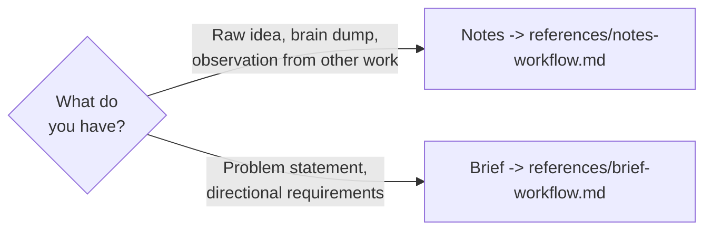

# Spectri Backlog

Captures ideas before they are ready for formal specification. Backlog items live in `spectri/specs/00-backlog/` and use two tiered document types based on maturity.

## Which Document Type?



| Type | When | Document | Template required? |
|------|------|----------|--------------------|
| **Notes** | Freeform capture — raw observations, brain dumps, meta-notes | `notes.md` | No — freeform, no structure requirements |
| **Brief** | Structured enough to spec from — problem statement and directional requirements | `brief.md` | Yes — light template with required sections |

<CRITICAL>
No `spec.md` may exist in `00-backlog/`. `spec.md` only appears after promotion to `01-drafting/` via `/spec.specify`.
</CRITICAL>

## Scaffolding

Both workflows use the scaffolding script to create the backlog item folder:

```bash
bash .spectri/scripts/spectri-core/create-backlog-item.sh \
  --type <notes|brief> \
  --short-name "<slug>" \
  "<description>"
```

This creates `spectri/specs/00-backlog/NNN-slug/` with the chosen document type and `meta.json`.

## Promotion to Drafting

When a backlog item is ready for formal specification, run `/spec.specify` against it. The specify command detects the item is in `00-backlog/`, reads the existing notes/brief content, moves the folder to `01-drafting/` via `git mv`, and creates `spec.md` using the existing content as input context. The original notes/brief file stays in the folder as historical context.

## Key Constraints

- `notes.md` and `brief.md` are exclusive to `00-backlog/` — once promoted, `spec.md` takes over
- Brainstorms stay in `spectri/coordination/brainstorms/`, not inside spec folders
- Observations during later work that spawn a new idea become a new backlog item, not additions to an existing spec's folder
