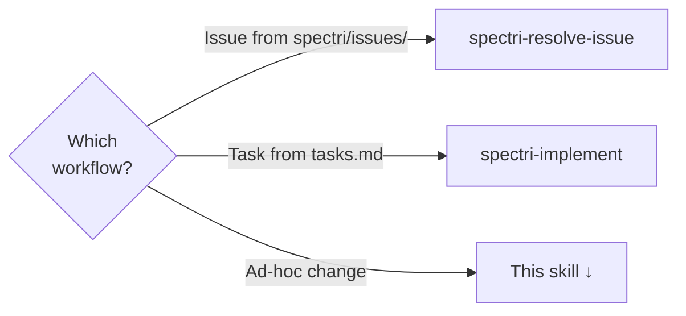
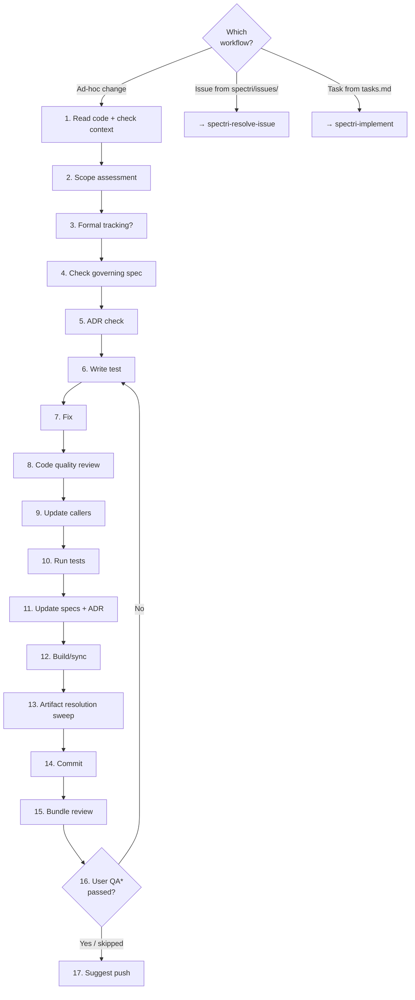

# Code Change

Full lifecycle from receiving an ad-hoc request to committing the change. Only applies when the work is NOT driven by a tracked issue or tasks.md item — for tracked work, see `spectri-resolve-issue` or `spectri-implement`.

This skill owns the entire workflow. There is no `/spec.code-change` command — the skill is the process.

## Which Workflow?

<HARD-GATE>
If the request references a tracked issue from `spectri/issues/`, use `spectri-resolve-issue` instead. If the work is a planned task from `tasks.md`, use `spectri-implement` instead.
</HARD-GATE>

Each branch routes to the skill that handles that type of work:

## Guiding Principles

### Smallest piece of work

Keep scope tight to the request. Complete it, commit it, move on. If you discover related problems, capture them as separate issues with `/spec.issue` — do not expand scope.

### The commit is a complete bundle

Every commit must include everything needed to close the loop. See Step 14 for the full bundle checklist.

**Do:**
- ✅ Include the code change (and tests) in the same commit
- ✅ Include spec update(s) if behaviour changed
- ✅ Include `/spec.summary` if a spec was updated
- ✅ Include ADR update if one was created at step 5
- ✅ Include resolved artifacts from artifact resolution sweep
- ✅ Stage spec updates BEFORE running `/spec.summary`

**Don't:**
- ❌ Commit code without its spec update ("I'll update the spec later")
- ❌ Commit the spec update without its summary ("I'll do the summary separately")
- ❌ Defer artifact resolution sweeps to a later session
- ❌ Leave tests out of the commit that introduces the behaviour they cover

| Excuse | Reality |
|--------|---------|
| "I'll update the spec in the next commit" | Spec and code diverge the moment they're in different commits. Bundle them. |
| "The summary can wait" | The summary is part of the bundle. One commit. |

### Workflow-skipping rationalisations

If you catch yourself thinking any of these, you are about to skip the workflow. Stop.

| Thought | Counter |
|---------|---------|
| "I know how to do this" | Knowing how is not the same as following the workflow. The workflow catches what you miss. |
| "It's just a quick fix" | Quick fixes are the most common source of skipped workflows. They accumulate into untracked technical debt. |
| "This doesn't need a test" | If it changes behaviour, it needs a test. If it doesn't change behaviour, say so explicitly at step 6. |
| "I'll come back to the skill steps later" | Later never comes. Execute the workflow now while context is fresh. |
| "The user just wants the change, not the process" | The user wants a reliable system. The process is what makes the system reliable. |
| "This is too small for the full workflow" | The workflow has a fast path for small changes. Use it instead of inventing your own. |

## Steps

<IMPORTANT>
**Before starting work on the steps below:**

1. Read the detailed instructions for each step in the sections that follow
2. Read and understand the workflow diagram at the end of the step details
3. Create a progress tracking item (e.g. TodoWrite) for every step in this list

**MUST NOT modify this file to check off steps.**
</IMPORTANT>

- [ ] 1. Read the code and check for context
- [ ] 2. Scope assessment
- [ ] 3. Consider formal tracking
- [ ] 4. Check for governing spec(s)
- [ ] 5. Check if ADR is needed
- [ ] 6. Write failing test (Red)
- [ ] 7. Make the fix (Green)
- [ ] 8. Review fix with sub-agents
- [ ] 9. Update callers if signatures changed
- [ ] 10. Run tests
- [ ] 11. Update affected spec(s) if behaviour changed
- [ ] 12. Build/sync if deployed files affected
- [ ] 13. Artifact resolution sweep
- [ ] 14. Commit
- [ ] 15. Bundle review with sub-agents
- [ ] 16. User QA if needed*
- [ ] 17. Suggest push to remote

### Step 1: Read the code and check for context

Read and understand the code you are about to change. Understand existing behaviour before modifying.

Check `spectri/coordination/threads/` for any threads with handoff context about this area of code. A previous session may have left notes relevant to your change.

<HARD-GATE>
Do not proceed until you understand how the current code works and what the requested change will affect. If the codebase area is unfamiliar, explore before changing.
</HARD-GATE>

### Step 2: Scope assessment

Does this need a plan before diving in? If yes, draft a brief conversational plan (bullet points in chat) and confirm with the user.

This is NOT an LLM plan artifact — if the scope warrants a formal plan, redirect to `/spec.plan` instead.

<CRITICAL>
If creating a conversational plan, the plan MUST encode commit bundle obligations (spec update, summary, tests) as explicit plan steps — do not rely on the agent remembering them during execution.
</CRITICAL>

### Step 3: Consider formal tracking

For non-trivial changes, two soft prompts (skip both for trivial fixes like typos or formatting):

1. **Issue**: "This is non-trivial. Want me to create an issue first?" If yes → create with `/spec.issue`, then switch to `spectri-resolve-issue` skill.
2. **Spec**: "No spec covers this feature. Want to create one now or later?" This is a nudge, not a gate — if the user says later, proceed.

If the user says just fix it, proceed.

### Step 4: Check for governing spec(s)

Check `spectri/specs/04-deployed/` and `02-implementing/` for specs covering the affected code. Note: `find-related-specs.sh` requires `--file` (an issue file). For code-change (no issue file), check specs manually by searching for your affected file paths in spec content.

| Situation | Action |
|-----------|--------|
| Spec exists | Read it. Your change MUST be reflected in the spec (step 11). |
| No spec exists | Note it and proceed. If the feature is significant, consider `/spec.retro` afterward. |
| Change contradicts a spec | Stop and confirm with user before proceeding — the spec may need updating or the request may be invalid. |

### Step 5: Check if ADR is needed

If the fix involves a significant architectural change, ask the user whether to create an ADR (`/spec.adr`) before proceeding with the implementation.

### Step 6: Write failing test (Red)

If the fix changes behaviour: write or update a test that describes the expected behaviour. The test MUST fail before your fix and pass after.

If the fix does not change behaviour (refactors, typos in strings, formatting, comment edits, documentation, config), skip to step 7. Existing tests will verify nothing broke at step 10.

### Step 7: Make the fix (Green)

Make the smallest change that addresses the request. May be code, documentation, spec correction, or config.

Write clean, simple code. Prefer the straightforward approach over the clever one.

Keep scope contained to the original request. If you discover related problems, capture them as separate issues with `/spec.issue` — do not expand scope.

### Step 8: Code quality review with sub-agents

If the fix involved code changes, launch 2 sub-agents in parallel to review the diff. Each receives:

- A brief description of what the change was supposed to do
- The changed files (`git diff` of unstaged changes, or `git diff HEAD` if already staged)

Instruction to each sub-agent: "Review this code change. Check:

- **Correctness**: Does the change do what it's supposed to? Are there edge cases or failure modes?
- **Brevity**: Could the same result be achieved with less code?
- **Structure**: Should any of this be split into separate files, functions, or modules?
- **Best practices**: Does the code follow the project's conventions and language idioms?
- **Side effects**: Could this change break anything?"

Evaluate their feedback:

- **Agree**: Apply the fix and note what changed
- **Disagree**: Explain why and move on
- **Unclear**: Ask the user to decide

For trivially small changes (typos, single-line corrections) or non-code fixes, skip to step 9.

### Step 9: Update callers if signatures changed

If you modified any function signature, return type, or interface, run `bash .spectri/scripts/spectri-workflow/find-callers.sh --names <changed-names> --exclude <definition-file>` to find all callers. You MUST update all reported callers before proceeding.

When multiple callers changed across a large scope, consider committing the caller updates as a tested intermediate commit before continuing. Do not leave callers broken across commits.

### Step 10: Run tests

If you changed code, run the project's test suite (e.g. `uv run pytest`, `npm test`, `cargo test`). All tests MUST pass before proceeding. For docs-only or config-only fixes, skip to step 11.

If tests were already failing before your change, note the pre-existing failures explicitly — your changes MUST NOT introduce new ones.

### Step 11: Update affected spec(s) if behaviour changed

If any of your changes altered behaviour documented in a spec, update those specs to reflect the new reality.

For each spec that needs updating:

1. Update `spec.md` with revised FRs/criteria
2. `git add` the spec immediately
3. Run `/spec.summary`
4. Run `/spec.update-meta`

<CRITICAL>
Stage the spec update BEFORE running `/spec.summary`. The summary reads staged changes — if the spec is unstaged, the summary misses it.
</CRITICAL>

If no governing spec exists and the change is significant, ask the user whether to run `/spec.retro` to create a retrospective spec for undocumented behaviour.

If you created an ADR at step 5, revisit it now. Update it with actual decisions, trade-offs, and outcomes from implementation — the pre-implementation ADR captured intent; the post-implementation update captures reality.

### Step 12: Build/sync if deployed files affected

If the fix touched source files that require a build or sync step, run it now to update deployed copies.

### Step 13: Artifact resolution sweep

If there's an associated issue file, run `bash .spectri/scripts/spectri-workflow/find-related-artifacts.sh --file <issue-file>` to find matching artifacts. Otherwise, manually search for threads, prompts, LLM plans, and RFCs matching your spec folder name or change description.

Resolve matching artifacts using scripts in `.spectri/scripts/spectri-trail/` — pass `--status` flag to avoid interactive prompts. Only resolve multi-item artifacts when ALL items are done. See `spectri/SPECTRI.md` for the full resolution lifecycle.

### Step 14: Commit

Before committing, run `bash .spectri/scripts/spectri-workflow/verify-commit-bundle.sh --mode code-change` to verify your staged changes form a complete bundle. If any required check fails (exit 3), stage the missing pieces before committing.

Stage everything. The commit must include:

- ✅ The code fix (and tests)
- ✅ Spec update(s) if behaviour changed
- ✅ `/spec.summary` if a spec was updated
- ✅ ADR update if one was created at step 5
- ✅ Artifact resolution sweep results

### Step 15: Bundle review with sub-agents

Before presenting to the user for QA, launch 3 sub-agents in parallel to review the committed bundle. Each receives the full `git diff` of the commit and the list of staged files.

**Sub-agent 1 — Code quality review:**
Review the full diff for correctness, brevity, structure, best practices, and side effects. Same criteria as step 8, but applied to the final committed state (which may include changes from caller updates, test fixes, etc. that weren't in the step 8 review).

**Sub-agent 2 — Bundle completeness review:**
Check the commit includes all required artifacts:
- Code + tests
- Spec update (if behaviour changed) + `/spec.summary`
- ADR update (if one was created)
- Artifact resolution sweep completed
- No stray unstaged files that should have been included

**Sub-agent 3 — Build/sync correctness review:**
If build/sync was run (step 12), verify deployed files match source. If build/sync was not needed, confirm no deployed files were accidentally edited directly.

Evaluate feedback: agree and fix (new commit — do not amend), disagree and explain, or escalate to user.

### Step 16: User QA if needed

If the fix warrants user verification, ask now — after the bundle review but before pushing.

If QA reveals problems:

1. The committed bundle stands — do not amend it
2. Loop back through steps 6–12 as a new commit cycle
3. That follow-up commit may itself need QA

### Step 17: Suggest push to remote

Ask the user if they'd like to push to remote now.

**Terminal state:** Change committed and pushed. If you missed capturing an unrelated problem with `/spec.issue` during step 7, create it now before ending the session.

## When Scope Expands

If investigation reveals the change is larger than expected:

1. Create issues for newly discovered problems — `/spec.issue` for each.
2. Note affected specs that need future attention.
3. Keep the current commit focused on the original request.
4. Leave the discovered issues for separate commits.

## Workflow Diagram

\* In most cases, user QA won't be required.
