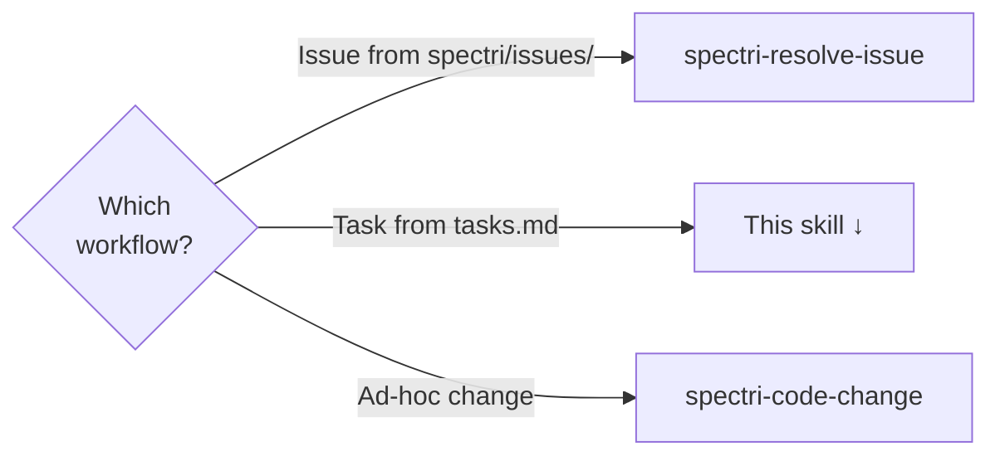
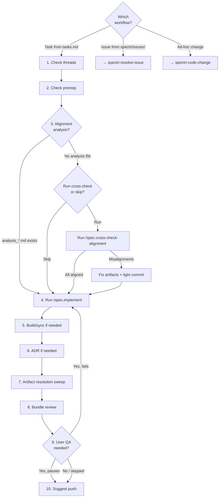

# Implement

Implements tasks from a Spectri spec's `tasks.md` using `/spec.implement`.

## Which Workflow?

<HARD-GATE>
If the work is driven by a tracked issue in `spectri/issues/`, use `spectri-resolve-issue` instead. If the work is ad-hoc without a task, use `spectri-code-change` instead.
</HARD-GATE>

Each branch routes to the skill that handles that type of work:



## Guiding Principles

### The commit is a complete bundle

`/spec.implement` handles the commit internally, but you must verify the bundle is complete before proceeding. A complete implementation bundle includes:

- Code changes + tests (from `/spec.implement`)
- Task marks checked off in `tasks.md` (from `/spec.implement`)
- Implementation summary (created by `/spec.implement` via `create-implementation-summary.sh`)
- `meta.json` updates (from `/spec.implement`)
- Build/sync output (Step 5 — your responsibility, not the command's)
- ADR if an architectural decision was made (Step 6 — your responsibility)

**Do:**
- ✅ Verify `/spec.implement` committed all expected artifacts
- ✅ Run build/sync if the implementation touched deployed source files
- ✅ Create an ADR if you made a significant architectural decision during implementation

**Don't:**
- ❌ Assume `/spec.implement` handled everything — build/sync and ADR are on you
- ❌ Skip the artifact resolution sweep because "the command already committed"
- ❌ Push before verifying the bundle is complete

### Workflow-skipping rationalisations

If you catch yourself thinking any of these, you are about to skip the workflow. Stop.

| Thought | Counter |
|---------|---------|
| "I know how to do this" | Knowing how is not the same as following the workflow. The workflow catches what you miss. |
| "/spec.implement handles everything" | It handles the core commit but NOT build/sync, ADR, or artifact resolution sweep. Those are your responsibility. |
| "I'll do the artifact sweep later" | Deferred sweeps get missed. Do it now while context is fresh. |
| "This task is too simple for the full workflow" | Simple tasks skip steps naturally (step 3 is optional, step 6 only fires if needed). The workflow already handles simplicity. |
| "The user just wants the code done" | The user wants a working system with traceability. The workflow provides that. |

## Steps

<IMPORTANT>
Before starting:

1. Read each step detail in the sections below
2. Read the workflow diagram at the end
3. Create a TodoWrite item for every step in this list

**MUST NOT modify this file to check off steps.**
</IMPORTANT>

- [ ] 1. Check active threads
- [ ] 2. Check prerequisite task dependencies
- [ ] 3. Verify alignment analysis exists
- [ ] 4. Run `/spec.implement`
- [ ] 5. Build/sync if deployed files affected
- [ ] 6. ADR if architectural decision made
- [ ] 7. Artifact resolution sweep
- [ ] 8. Bundle review with sub-agents
- [ ] 9. User QA if needed
- [ ] 10. Suggest push to remote

### Step 1: Check active threads

Check `spectri/coordination/threads/{spec-folder}/` for active thread files. If one exists, read it and continue from where it left off before doing anything else.

### Step 2: Check prerequisite task dependencies

Open `tasks.md` and find the target task. Check whether any tasks listed as predecessors are still unchecked. If a blocking dependency is incomplete, implement it first or confirm with the user before proceeding.

### Step 3: Verify alignment analysis exists

Check for `analysis_*.md` files in the spec folder.

**If analysis exists** — cross-check alignment has been run. Proceed to Step 4.

**If no analysis file:**

1. Ask the user: run `/spec.cross-check-alignment` now, or skip?
2. If skip → proceed to Step 4
3. If run → execute `/spec.cross-check-alignment`
4. If the analysis finds misalignments:
   - Fix `spec.md`, `plan.md`, and/or `tasks.md` as the analysis recommends
   - Create an implementation summary of the alignment fixes
   - Light prep commit: stage the fixed artifacts + summary only. This is NOT a full bundle — no bundle review, no artifact resolution sweep. This establishes a clean baseline.
5. Proceed to Step 4 from an aligned state

### Step 4: Run `/spec.implement`

Run the command. It handles prerequisite validation, loading `tasks.md` and `plan.md`, TDD, coding, task completion, implementation summary, `meta.json` update, stage advancement, and commit.

```
/spec.implement          # full implementation
/spec.implement <phase>  # single-phase mode
```

<HARD-GATE>
The command is the implementation. Do not write code outside of it. If the command fails or blocks, report it to the user — do not improvise a workaround.
</HARD-GATE>

### Step 5: Build/sync if deployed files affected

If the task touched source files that require a build or sync step (commands, skills, scripts), run it now to update deployed copies.

### Step 6: ADR if architectural decision made

If the implementation involved a significant architectural decision, create an ADR now: `/spec.adr`.

### Step 7: Artifact resolution sweep

If an associated issue file exists, run `bash .spectri/scripts/spectri-workflow/find-related-artifacts.sh --file <issue-file>` to find matching artifacts. Otherwise, manually search for threads, prompts, LLM plans, and RFCs matching your spec folder name or task description.

Resolve matching artifacts using scripts in `.spectri/scripts/spectri-trail/` — pass `--status` flag to avoid interactive prompts. Only resolve multi-item artifacts when ALL items are done. See `spectri/SPECTRI.md` for the full resolution lifecycle.

After `/spec.implement` completes, you can also run `bash .spectri/scripts/spectri-workflow/verify-commit-bundle.sh --mode implement-task --file <tasks.md>` to verify the committed bundle is complete.

### Step 8: Bundle review with sub-agents

Before presenting to the user for QA, launch 3 sub-agents in parallel to review the committed bundle. Each receives the `git diff` of the commit(s) made by `/spec.implement` plus any subsequent commits from steps 5–7.

**Sub-agent 1 — Code quality review:**
Review the full diff for correctness, brevity, structure, best practices, and side effects. Assess whether the implementation matches the task descriptions in `tasks.md`.

**Sub-agent 2 — Bundle completeness review:**
Check the bundle includes all required artifacts:
- Code + tests
- Task marks checked off in `tasks.md`
- Implementation summary created
- `meta.json` updated
- Build/sync output (if applicable)
- ADR (if applicable)
- Artifact resolution sweep results
- No stray unstaged files that should have been included

**Sub-agent 3 — Build/sync correctness review:**
If build/sync was run (step 5), verify deployed files match source. If build/sync was not needed, confirm no deployed files were accidentally edited directly.

Evaluate feedback: agree and fix (new commit — do not amend), disagree and explain, or escalate to user.

### Step 9: User QA if needed

If the implementation warrants user verification, ask now — after the bundle review but before pushing. If QA reveals problems, loop back to step 4 for a new implementation cycle.

In most cases, user QA won't be required.

### Step 10: Suggest push to remote

Ask the user if they'd like to push to remote now.

**Terminal state:** task complete, committed, and pushed.

## Workflow Diagram


