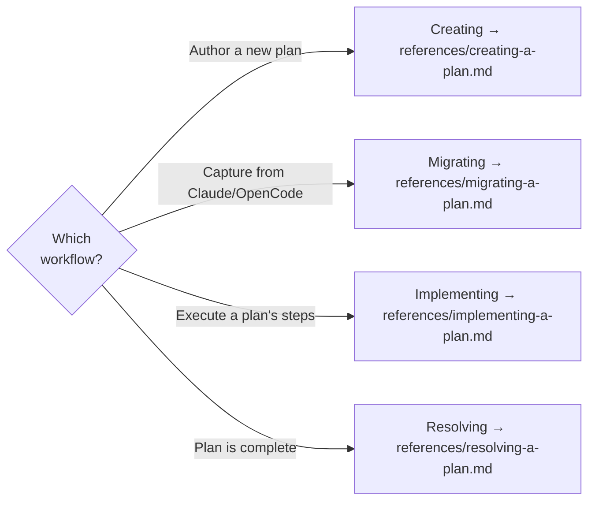

# Spectri LLM Plans

<CRITICAL>
LLM plans are NOT spec `plan.md` files. A spec's plan is a design artefact inside a spec folder. LLM plans are agent coordination documents — they describe what needs to happen, not how to write the code.
</CRITICAL>

## Which Workflow?

Identify which workflow applies and read the corresponding reference file before starting.

| Workflow | When | Reference |
|----------|------|-----------|
| **Creating** | Authoring a new plan directly in conversation | `references/creating-a-plan.md` |
| **Migrating** | Capturing an existing plan from Claude's `~/.claude/plans/` or OpenCode's `.opencode/plans/` | `references/migrating-a-plan.md` |
| **Implementing** | Executing a plan's steps — code, config, docs, scaffolding | `references/implementing-a-plan.md` |
| **Resolving** | All plan steps are done, or plan is superseded/abandoned | `references/resolving-a-plan.md` |

## Key Principle — Directional, Not Prescriptive

Plans MUST be directional — describe outcomes and point to skills/commands, never enumerate their steps. A prescriptive plan shadows the skill it references, causing agents to follow the plan's incomplete version instead of the actual skill. See `references/plan-conventions.md` for the full directional standard, execution structure patterns, and verification format.

<CRITICAL>
Plans MUST NOT contain code blocks. Two reasons:

1. **Staleness** — code goes stale as other agents change the codebase between plan creation and execution
2. **Bypassed investigation** — agents treat code blocks as copy-paste solutions, skipping the codebase reading and context-gathering they would otherwise do. The implementing agent must investigate current state, not assume the plan's code is correct.

Describe expected outcomes per step instead.
</CRITICAL>

### Zero-Context Persona

Write plans as if the executor has zero project knowledge. Every reference must be a file path, every decision must include rationale, every step must be independently executable. Plans that assume context produce agents that fail after compaction or session handoff.

## Plans as a Change Path

Plans coordinate work at any scale — they are not limited to small changes or spec-free work.

| Scale | Example | Spec relationship |
|-------|---------|-------------------|
| **Sub-spec** | CSS migration, config refactoring, scaffolding | No spec needed — the plan coordinates directly |
| **Spec-adjacent** | Infrastructure prep that enables spec work | Related to specs but not owned by one |
| **Supra-spec** | Resolve 7 issues in sequence, orchestrate across multiple specs | Spans beyond any single spec's scope |

Plans coordinate the work; skills handle obligations.
