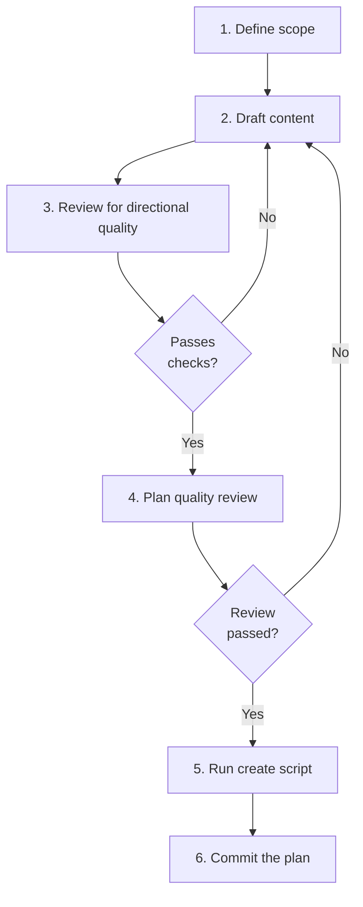

# Creating a Plan

For authoring a new plan from scratch. If capturing an existing plan from Claude or OpenCode, see `migrating-a-plan.md` instead.

## Guiding Principles

### Direct authoring is a first-class path

Plans can be authored fresh during any conversation by any agent. This is the primary creation path — not a workaround for when no source file exists.

### Write for an agent with zero context

The implementing agent may have never seen this codebase. Each step should describe what needs to happen, why it matters, and what success looks like. Point to skills and commands by name — don't enumerate their steps.

### One plan, one commit

Don't batch plan creation with other unrelated work.

## Steps

<IMPORTANT>
**Before starting work on the steps below:**

1. Read the detailed instructions for each step in the sections that follow
2. Create a TodoWrite item for every step in this list

**MUST NOT modify this file to check off steps.**
</IMPORTANT>

- [ ] 1. Define the plan scope
- [ ] 2. Draft plan content
- [ ] 3. Review for directional quality
- [ ] 4. Plan quality review
- [ ] 5. Run create script
- [ ] 6. Commit the plan

### Step 1: Define the plan scope

Identify what this plan covers and at what scale:

| Scale | Example | Spec relationship |
|-------|---------|-------------------|
| **Sub-spec** | CSS migration, config refactoring, scaffolding | No spec needed |
| **Spec-adjacent** | Infrastructure prep that enables spec work | Related to specs but not owned by one |
| **Supra-spec** | Resolve 7 issues, orchestrate across multiple specs | Spans beyond any single spec |

Clarify with the user if the scope is ambiguous.

### Step 2: Draft plan content

Follow the universal skeleton from `plan-conventions.md`: Context → Steps → Verification. Choose the execution structure (flat steps, named phases, parallel delegation, or artifact-organised) that fits the task.

For each step, describe:

- **What** needs to happen (outcome, not implementation)
- **Why** it matters (context for the implementing agent)
- **What success looks like** (how the implementing agent knows the step is done)
- **Which skill or command** to use, if applicable — name it, don't enumerate its steps

Include an empty `## Execution Log` section at the end — the implementing agent populates this during execution.

### Step 3: Review for directional quality

Verify the plan meets directional standards using the quick check from `plan-conventions.md`:

| Check | Pass? |
|-------|-------|
| No code blocks | |
| No line number references | |
| No enumerated skill/command steps (point to the skill, don't list its steps) | |
| Each step describes an outcome, not an implementation | |
| An agent with zero codebase context could understand what to do | |
| Includes `## Execution Log` section (empty) | |

See `plan-conventions.md` for the full directional standard and the graduated scale for when prescriptive elements are justified.

### Step 4: Plan quality review

Launch 3 sub-agents to review the draft plan before saving. See `plan-quality-review.md` for review scopes (implementability, relevance and focus, feasibility and ordering) and agent-specific instructions.

Each reviewer simulates being the implementing agent — walking through every step imagining they must execute it with zero codebase context.

<HARD-GATE>
Do not proceed to the create script until all review feedback is addressed. Loop on feedback: agree and fix, disagree and explain, or escalate to the user.
</HARD-GATE>

### Step 5: Run create script

```bash
bash .spectri/scripts/spectri-trail/create-llm-plan.sh \
  --title "Plan Title" \
  --slug "plan-slug" \
  --original direct \
  --agent <agent-name>
```

| Flag | Required | Notes |
|------|----------|-------|
| `--title` | Yes | Human-readable plan title |
| `--slug` | Yes | Kebab-case identifier for the filename |
| `--original` | Yes | `direct` for freshly authored plans |
| `--agent` | Yes | Agent name (claude, qwen, gemini, etc.) |
| `--source` | No | Path to the originating prompt, if one exists |
| `--workstream` | No | Workstream tag |
| `--reviewed-by` | No | Who reviewed the plan |
| `--json` | No | Output created path as JSON |

The script creates proper frontmatter, copies the plan body, and auto-stages the file.

### Step 6: Commit the plan

Commit the staged plan file:

```
docs(plan): create <plan-slug> — <brief description>
```

**Terminal state:** Plan committed with directional content and proper frontmatter.

## Workflow Diagram


