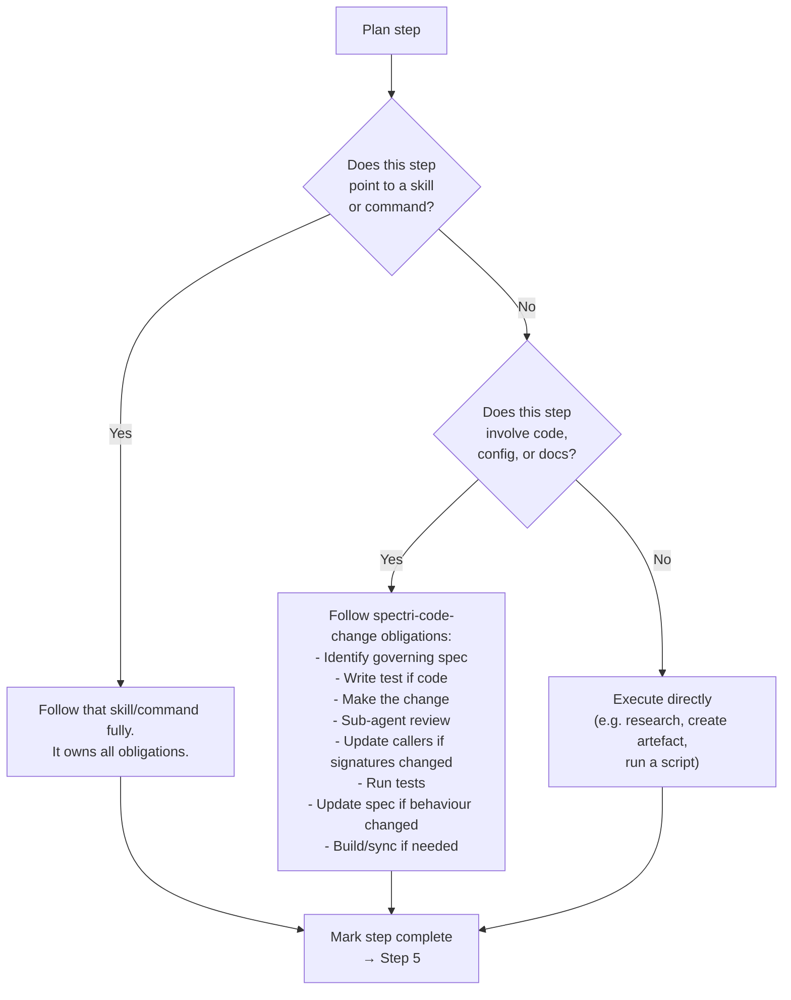
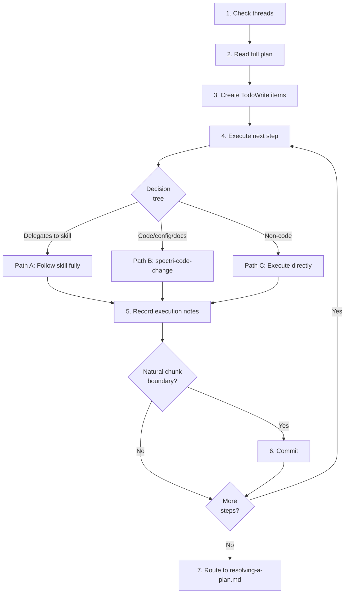

# Implementing a Plan

## Guiding Principles

### Smallest piece of work

Commit and test early, commit and test often. Don't accumulate dozens of file changes — break work into commits at natural chunk boundaries. A completed plan should be a trail of small commits, not one massive changeset.

### Delegated skill owns all obligations

When a plan step points to a skill or command (e.g. "resolve issue X using spectri-resolve-issue"), the agent runs that skill and the skill owns all obligations for that step. The plan does not independently layer spectri-code-change on top. Follow the delegated skill fully, then return to the plan and check off the item.

### Scope containment

If you discover unrelated problems while implementing, capture them as separate issues with `/spec.issue`. Do not expand plan scope mid-execution.

### Plans coordinate, skills drive

The plan says what needs to happen. Skills say how. If a plan step and a skill disagree, the skill is authoritative — the plan may be stale or imprecise. When in doubt, follow the skill.

## Steps

<IMPORTANT>
**Before starting work on the steps below:**

1. Read the detailed instructions for each step in the sections that follow
2. Read and understand the workflow diagram at the end of the step details
3. Create a TodoWrite item for every step in this list

**MUST NOT modify this file to check off steps.**
</IMPORTANT>

- [ ] 1. Check for continuation context
- [ ] 2. Read the full plan
- [ ] 3. Create TodoWrite items for each plan step
- [ ] 4. Execute each step (decision tree)
- [ ] 5. Record execution notes after each step
- [ ] 6. Commit at natural chunk boundaries
- [ ] 7. When all steps done — route to resolving

### Step 1: Check for continuation context

Check `spectri/coordination/threads/` for threads referencing this plan. A previous agent may have started implementation and left handoff notes.

### Step 2: Read the full plan

Read the entire plan file. Understand the full scope before executing any steps.

If the plan references skills, commands, or other artefacts, read those too — you need to understand what each step involves before creating your work plan.

<HARD-GATE>
Do not start executing until you understand the full plan scope and have identified which skill or workflow each step requires. If anything is ambiguous, ask the user for clarification.
</HARD-GATE>

### Step 3: Create TodoWrite items for each plan step

Create a TodoWrite item for every step in the plan. This is your tracking mechanism for progress.

### Step 4: Execute each step (decision tree)

For each plan step, determine which path applies:



**Path A — Step delegates to a skill or command:**
Run that skill or command. The skill handles everything: spec lookup, tests, review, commit bundle. When the skill completes, return to the plan.

<CRITICAL>
The skill is authoritative. If the skill encounters a hard-gate that stops execution (e.g. blocked issue, failing precondition), that gate takes precedence over the plan. Do not override the skill's hard-gates to satisfy the plan. Record the gate in your execution notes and ask the user how to proceed.
</CRITICAL>

**Path B — Step involves code/config/docs without a named skill:**
Follow `spectri-code-change` obligations. This means: identify the governing spec (if any), write a test (if code), make the change, review with sub-agents, update callers, run tests, update the spec if behaviour changed, build/sync if deployed files affected.

**Path C — Step is non-code work:**
Execute directly. This covers research tasks, artefact creation, running scripts, or other work that doesn't produce code changes.

| Excuse | Reality |
|--------|---------|
| "I'll batch the whole plan into one commit at the end" | Commit per natural chunk. A trail of small commits, not one massive changeset. |
| "The plan said to do X so I skipped the skill's steps" | The skill is authoritative, not the plan. Follow the skill fully. |
| "I found a related problem so I fixed it too" | Scope creep. Capture with `/spec.issue` and stay on the plan. |
| "I don't need to check for a governing spec — it's just a plan" | Path B still requires spec lookup. Plans don't exempt you from code-change obligations. |

### Step 5: Record execution notes after each step

After completing each plan step, mark it off in your TodoWrite and append an execution log entry to the plan file.

<HARD-GATE>
Every plan step MUST have a corresponding execution log entry before proceeding to the next step. A step without a log entry is not complete — regardless of whether the code was written and committed.
</HARD-GATE>

Append entries to the `## Execution Log` section at the end of the plan file. Use the format:

```markdown
### [Agent Session ID] — Step [N] — [Date]
- **What was done**: [summary]
- **Verification**: [test results, command output, pass/fail — evidence, not just "done"]
- **Blockers/deviations**: [anything unexpected, or "none"]
- **Commit**: [hash, or "no commit for this step"]
```

Each entry MUST include verification evidence — test output summaries, command results, pass/fail status. "Tests passed" is acceptable; omitting the field entirely is not. A reviewing agent uses these entries to confirm compliance without re-running the work.

Rules:
- Each agent adds new entries; do not edit previous entries
- Record blockers and deviations, not just successes
- If a step has no verification requirement, state "N/A — no verification defined for this step"
- When the plan resolves, the execution log becomes the permanent audit trail

See `plan-conventions.md` for the execution log convention and why it exists.

### Step 6: Commit at natural chunk boundaries

Commit per natural chunk of work — not per plan step, not per skill invocation, not all at end. A natural chunk is the smallest coherent piece of work that makes sense on its own.

What belongs in each intermediate commit:

- The code/config/docs changes for this chunk
- Updated tests for changed code
- Spec update if this chunk changed documented behaviour
- `/spec.summary` if a spec was updated

### Step 7: When all steps done — route to resolving

When every plan step is marked complete with execution notes, proceed to `resolving-a-plan.md` to close out the plan. If the plan includes a completion review as its final step (added via the plan template), that step must pass before routing here.

If you are approaching context limits before all steps are done, stop and create a thread using the `spectri-threads` skill immediately. Include: which steps are complete (with commit hashes), the next step to execute, and any blockers found. You do not need to complete the entire plan in one session.

<HARD-GATE>
Do not end your session without either resolving the plan or creating a thread (using the `spectri-threads` skill) with handoff notes for the next agent. Unresolved plans without continuation context get lost.
</HARD-GATE>

**Terminal state:** All plan steps executed and marked complete with execution notes. Plan routed to `resolving-a-plan.md`.

## Workflow Diagram


