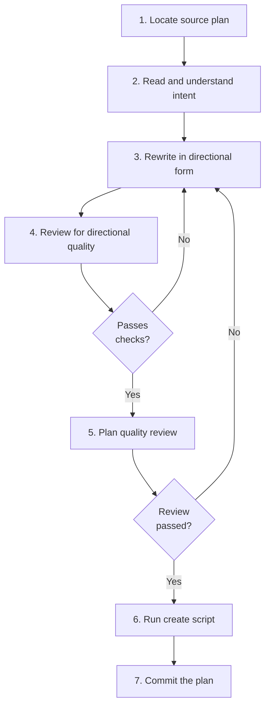

# Migrating a Plan

For capturing an existing plan from an agent's built-in planning and translating it to directional form. If authoring a new plan from scratch, see `creating-a-plan.md` instead.

## Guiding Principles

### Agent plans are always prescriptive

Plans from Claude's `~/.claude/plans/` and OpenCode's `.opencode/plans/` are written by the planning agent for its own use — they contain code blocks, specific variable names, line references, and enumerated implementation steps. This is fine for the agent that wrote them, but unusable as coordination documents. Translation to directional form is mandatory.

### Translation is not editing — it's rewriting

Don't try to "clean up" the source plan. Read it, understand the intent, and rewrite it from scratch in directional form. The source is a reference, not a starting point for editing.

### Preserve the source

The original plan file stays where it is (e.g., `~/.claude/plans/`). The create script records its path in frontmatter (`original:` field) for traceability. The raw source is never copied to an agent subfolder — only the rewritten directional plan is saved, and it goes to root `llm-plans/`.

## Known Plan Sources

| Agent | Location | Format | Migration? |
|-------|----------|--------|------------|
| **Claude Code** | `~/.claude/plans/` | Markdown, global (not per-project) | ✅ Yes |
| **OpenCode** | `.opencode/plans/` | Markdown, per-project | ✅ Yes |
| **Qwen Code** | None | N/A — ephemeral, in-memory only | ❌ No plans to migrate |

### Qwen Code Note

Qwen Code has plan mode, but it does **NOT** persist plans to files. Plans exist only in session memory via the `exit_plan_mode` tool. Qwen stores simple task lists (todos) as JSON files in `~/.qwen/todos/`, but these are not detailed implementation plans suitable for migration. See `spectri/research/2026-03-12-qwen-code-plan-mode-comparison-research.md` for the full comparison.

Other agents may persist plans in the future — the workflow is the same regardless of source.

## Steps

<IMPORTANT>
**Before starting work on the steps below:**

1. Read the detailed instructions for each step in the sections that follow
2. Create a TodoWrite item for every step in this list

**MUST NOT modify this file to check off steps.**
</IMPORTANT>

- [ ] 1. Locate the source plan
- [ ] 2. Read and understand intent
- [ ] 3. Rewrite in directional form
- [ ] 4. Review for directional quality
- [ ] 5. Plan quality review
- [ ] 6. Run create script
- [ ] 7. Commit the plan

### Step 1: Locate the source plan

Find the plan file in the agent's plan directory:

- **Claude** — `~/.claude/plans/`. Plans are named by session. Identify which session plan is relevant.
- **OpenCode** — `.opencode/plans/` in the project directory.

Read the file. If multiple plans exist and it's unclear which one applies, ask the user.

### Step 2: Read and understand intent

Read the entire source plan. Identify:

- The overall goal — what is this plan trying to achieve?
- The logical steps — what needs to happen in what order?
- Dependencies between steps
- Which steps involve code changes vs artefact creation vs other work
- Which existing Spectri skills or commands each step should use

Do not start rewriting until you understand the full plan.

### Step 3: Rewrite in directional form

Write the plan from scratch in directional form. For each step:

- **What** needs to happen (outcome, not implementation)
- **Why** it matters (context for the implementing agent)
- **What success looks like**
- **Which skill or command** to use — name it, don't enumerate its steps

Strip everything prescriptive from the source:

| Source contains | Translation |
|----------------|-------------|
| Code blocks | Remove entirely — describe the expected outcome instead |
| Line number references | Remove — describe the file and what should change |
| Enumerated skill steps | Replace with "use [skill-name]" |
| Specific variable/function names | Keep only when essential for clarity; describe intent instead |

Include an empty `## Execution Log` section at the end of the rewritten plan.

### Step 4: Review for directional quality

Verify the rewritten plan meets directional standards:

| Check | Pass? |
|-------|-------|
| No code blocks | |
| No line number references | |
| No enumerated skill/command steps (point to the skill, don't list its steps) | |
| Each step describes an outcome, not an implementation | |
| An agent with zero codebase context could understand what to do | |
| Includes `## Execution Log` section (empty) | |

See `plan-conventions.md` for the full directional standard and the graduated scale for when prescriptive elements are justified.

### Step 5: Plan quality review

Launch 3 sub-agents to review the rewritten plan before saving. See `plan-quality-review.md` for review scopes (implementability, relevance and focus, feasibility and ordering) and agent-specific instructions.

Each reviewer simulates being the implementing agent — walking through every step imagining they must execute it with zero codebase context.

<HARD-GATE>
Do not proceed to the create script until all review feedback is addressed. Loop on feedback: agree and fix, disagree and explain, or escalate to the user.
</HARD-GATE>

### Step 6: Run create script

```bash
bash .spectri/scripts/spectri-trail/create-llm-plan.sh \
  --title "Plan Title" \
  --slug "plan-slug" \
  --original "<path-to-source-plan>" \
  --agent <agent-name>
```

| Flag | Required | Notes |
|------|----------|-------|
| `--title` | Yes | Human-readable plan title |
| `--slug` | Yes | Kebab-case identifier for the filename |
| `--original` | Yes | Path to the source plan file |
| `--agent` | Yes | Agent that authored the original (claude, opencode, etc.) |
| `--source` | No | Path to the originating prompt, if one exists |
| `--workstream` | No | Workstream tag |
| `--reviewed-by` | No | Who reviewed the plan |
| `--json` | No | Output created path as JSON |

The script creates the plan at `spectri/coordination/llm-plans/YYYY-MM-DD-{agent}-{slug}.md` (root level, not in an agent subfolder) with proper frontmatter (including `original:` pointing to the source), copies the rewritten plan body, and auto-stages the file.

### Step 7: Commit the plan

Commit the staged plan file:

```
docs(plan): migrate <plan-slug> from <source-agent> — <brief description>
```

**Terminal state:** Plan committed with directional content, source path recorded in frontmatter.

## Workflow Diagram


