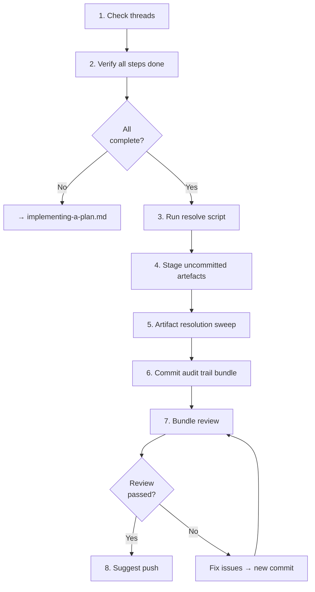

# Resolving a Plan

## Guiding Principles

### Resolve immediately, not later

Deferred resolution gets missed. When the last plan step is done, resolve the plan in the same session. Do not leave it for a future agent.

### Bundle everything uncommitted at the end

The resolution commit includes the resolved plan plus any artefacts from final tidy-up that haven't been committed yet. Earlier artefacts are already in git history.

## Steps

<IMPORTANT>
**Before starting work on the steps below:**

1. Read the detailed instructions for each step in the sections that follow
2. Create a TodoWrite item for every step in this list

**MUST NOT modify this file to check off steps.**
</IMPORTANT>

- [ ] 1. Check for continuation context
- [ ] 2. Verify all plan steps are done
- [ ] 3. Run resolve script
- [ ] 4. Stage uncommitted artefacts from tidy-up
- [ ] 5. Artifact resolution sweep
- [ ] 6. Commit the audit trail bundle
- [ ] 7. Bundle review
- [ ] 8. Suggest push

### Step 1: Check for continuation context

Check `spectri/coordination/threads/` for threads referencing this plan. If another agent started the resolve process and left handoff notes, pick up from where they left off.

### Step 2: Verify all plan steps are done

Review the plan file and your TodoWrite items. Every plan step should be marked complete with execution notes recorded (per implementing-a-plan.md Step 5).

If any steps are incomplete, go back to `implementing-a-plan.md` and finish them.

If steps were intentionally skipped, record why in the execution notes before proceeding.

### Step 3: Run resolve script

```bash
bash .spectri/scripts/spectri-trail/resolve-llm-plan.sh <plan-file> --status <status>
```

| Status | When |
|--------|------|
| `implemented` | Plan was fully executed |
| `superseded` | Replaced by a newer plan or approach |
| `abandoned` | Plan is no longer needed |

The script updates frontmatter status fields and moves the file to `resolved/` via `git mv` (auto-staged).

Optional: `--notes "brief resolution summary"` to add resolution notes to frontmatter.

<HARD-GATE>
After running the resolve script, verify with `git status` that the file move (deletion from active location + addition in `resolved/`) is staged. Do not proceed until both are staged.
</HARD-GATE>

### Step 4: Stage uncommitted artefacts from tidy-up

Check for any new artefacts created during the final round of work that haven't been committed yet — issues filed, threads created, documentation updated. Stage them.

Artefacts committed during earlier implementation steps are already in the git history. This step only covers what remains uncommitted.

### Step 5: Artifact resolution sweep

Run `bash .spectri/scripts/spectri-workflow/find-related-artifacts.sh --file <plan-file>` to find threads, prompts, and other plans referencing this plan or its related work.

Review the output and resolve matching artefacts using scripts in `.spectri/scripts/spectri-trail/`. Only resolve multi-item artefacts when ALL items are done.

### Step 6: Commit the audit trail bundle

Stage everything and commit:

- The resolved plan file (moved to `resolved/`)
- Any uncommitted artefacts from Step 3
- Artifact resolution sweep results from Step 4

This is one commit — the audit trail bundle. Everything related to closing out this plan lands together.

```
docs(plan): resolve <plan-slug> — <brief outcome>
```

### Step 7: Bundle review

Launch 2 sub-agents in parallel to review the committed bundle:

**Sub-agent 1 — Completeness review:**
- All plan steps have execution notes
- Resolved plan is in `resolved/`
- No stray unstaged artefacts that should have been included
- Related artefacts resolved where appropriate

**Sub-agent 2 — Audit trail review:**
- Execution notes are meaningful (not just "done")
- Skipped steps have documented reasons
- Resolution status matches what was actually done

Evaluate feedback: agree and fix (new commit — do not amend), disagree and explain, or escalate to user.

### Step 8: Suggest push

Ask the user if they'd like to push to remote now.

<HARD-GATE>
Do not consider the plan resolved until the bundle review (Step 7) has passed. An incomplete resolution is worse than no resolution — it signals "done" when artefacts may be missing.
</HARD-GATE>

**Terminal state:** Plan resolved, audit trail committed, pushed.

## Workflow Diagram


