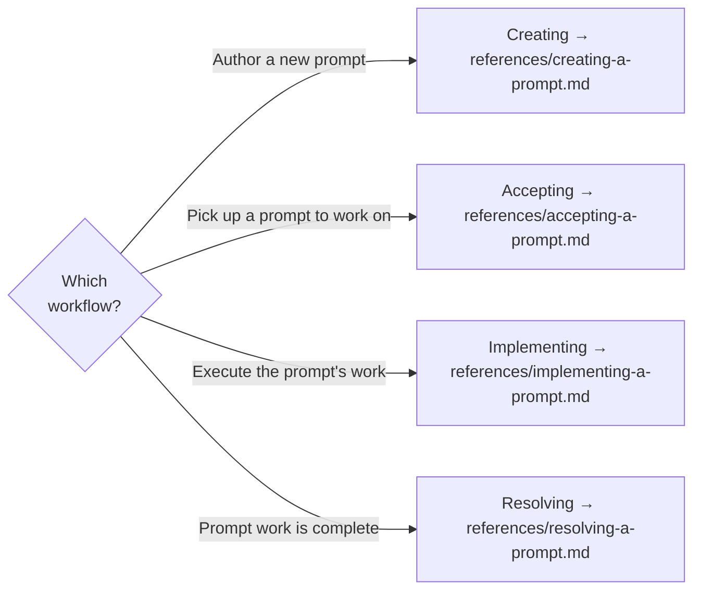

# Spectri Prompts

Agent handoff prompts that coordinate work across sessions. A prompt captures a discrete task in enough detail that any agent can pick it up and execute it without prior context.

## Key Principle — One Prompt, One Task

<CRITICAL>
A prompt covers a single, discrete task. If the work requires multiple coordinated steps, use a plan instead. If the work is continuation of in-flight state, use a thread instead.
</CRITICAL>

## Which Workflow?

Identify which workflow applies and read the corresponding reference file before starting.

| Workflow | When | Reference |
|----------|------|-----------|
| **Creating** | Authoring a new prompt to hand off work to another agent | `references/creating-a-prompt.md` |
| **Accepting** | Picking up an existing prompt — reading, understanding, confirming scope | `references/accepting-a-prompt.md` |
| **Implementing** | Executing the prompt's work (code, config, docs, research) | `references/implementing-a-prompt.md` |
| **Resolving** | All prompt work is complete, or prompt is superseded | `references/resolving-a-prompt.md` |

## Prompts vs Threads vs Plans

| Artifact | Purpose | Lifecycle |
|----------|---------|-----------|
| **Prompt** | Discrete task for another agent — self-contained, actionable | Create → Accept → Implement → Resolve |
| **Thread** | Continuation context for unfinished work — what remains to be done | Create → Resume → Resolve |
| **Plan** | Multi-step coordination — orchestrates work across skills and sessions | Create → Implement → Resolve |

Use a prompt when the work is a single, describable task. Use a thread when stopping mid-task and handing off in-flight state. Use a plan when coordinating multiple steps or spanning multiple specs.

## Prompt Template

For the template structure that all prompts must follow, see `references/prompt-template.md`.
