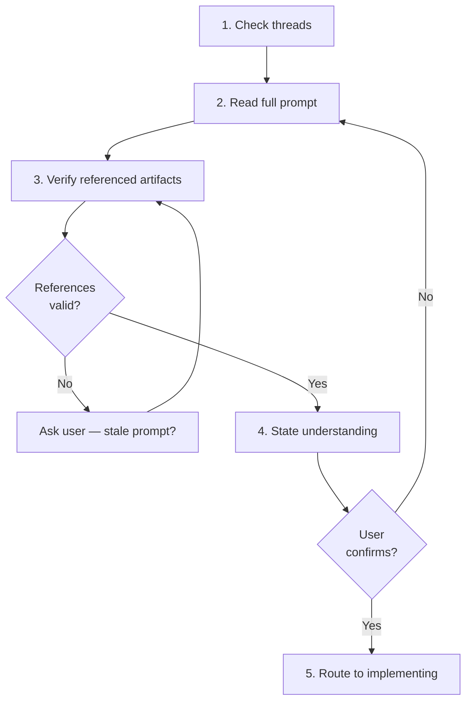

# Accepting a Prompt

Accepting is the bridge between receiving a prompt and beginning implementation. The purpose is to confirm understanding before investing work — catching ambiguity early prevents wasted effort.

## Guiding Principles

### Understand before acting

Read the entire prompt file before starting any work. The prompt was written by another agent or user who may have implicit assumptions. Surface those assumptions now.

### Ambiguity stops execution

If anything in the prompt is unclear — scope, expected output, constraints, referenced files — ask for clarification. Do not guess and proceed.

## Steps

<IMPORTANT>
**Before starting work on the steps below:**

1. Read the detailed instructions for each step in the sections that follow
2. Create a TodoWrite item for every step in this list

**MUST NOT modify this file to check off steps.**
</IMPORTANT>

- [ ] 1. Check for continuation context
- [ ] 2. Read the full prompt
- [ ] 3. Verify referenced artifacts exist
- [ ] 4. State understanding
- [ ] 5. Route to implementing

### Step 1: Check for continuation context

Check `spectri/coordination/threads/` for threads referencing this prompt or its related work. A previous agent may have started the work and left handoff notes.

### Step 2: Read the full prompt

Read the entire prompt file. Understand what is being asked, why, and what the expected output looks like.

### Step 3: Verify referenced artifacts exist

If the prompt references specs, issues, files, or other artifacts, verify they exist at the specified paths. Missing references indicate the prompt may be stale or the codebase has changed since it was written.

### Step 4: State understanding

<HARD-GATE>
MUST NOT begin implementation until you can state:
1. What the prompt asks for
2. What the expected output looks like
3. What constraints apply

If anything is ambiguous, ask the user for clarification before proceeding. Do not guess.
</HARD-GATE>

State your understanding to the user. This serves as a checkpoint — the user can correct misunderstandings before work begins.

### Step 5: Route to implementing

Once understanding is confirmed, proceed to `implementing-a-prompt.md` to execute the work.

**Terminal state:** Prompt understood, ambiguities resolved, ready to implement.

## Workflow Diagram

