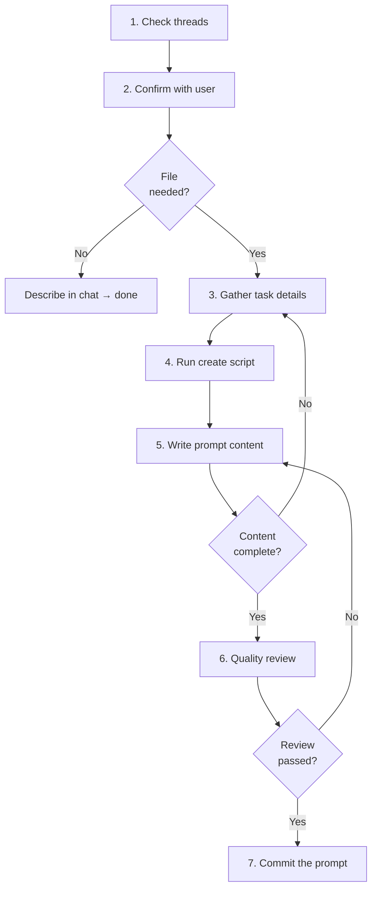

# Creating a Prompt

## Guiding Principles

### Write for an agent with zero context

The receiving agent has never seen your session. Every prompt must contain enough context — what, why, inputs, expected output, constraints — for a cold start. If the prompt references a spec, issue, or plan, include the path.

### Ask before creating a file

Not every handoff needs a persistent artifact. Confirm with the user before creating a file.

## Steps

<IMPORTANT>
**Before starting work on the steps below:**

1. Read the detailed instructions for each step in the sections that follow
2. Create a TodoWrite item for every step in this list

**MUST NOT modify this file to check off steps.**
</IMPORTANT>

- [ ] 1. Check for continuation context
- [ ] 2. Confirm file creation with user
- [ ] 3. Gather task details
- [ ] 4. Run create script
- [ ] 5. Write prompt content
- [ ] 6. Quality review
- [ ] 7. Commit the prompt

### Step 1: Check for continuation context

Check `spectri/coordination/threads/` for threads related to the work you are about to hand off. A previous agent may have left context that belongs in the prompt.

### Step 2: Confirm file creation with user

Ask the user: "Do you want this saved as a prompt file, or just described in the chat?"

If the user wants chat-only, describe the task in conversation and stop — no file needed.

### Step 3: Gather task details

Collect enough information to write a complete prompt. The prompt must answer:

| Field | Question |
|-------|----------|
| **What** | What needs to be done? |
| **Why** | Why does this need to happen? (context) |
| **Inputs** | What inputs are available? (file paths, specs, issues) |
| **Expected output** | What does the result look like? |
| **Constraints** | Any boundaries, deadlines, or limitations? |

If the user gives a vague description, ask clarifying questions until you have enough for a zero-context agent to execute.

### Step 4: Run create script

```bash
bash .spectri/scripts/spectri-trail/create-prompt.sh --title "Task title"
```

| Flag | Required | Notes |
|------|----------|-------|
| `--title` | Yes | Human-readable task title |
| `--json` | No | Output created path as JSON |

The script creates `spectri/coordination/prompts/YYYY-MM-DD-slug.md` with correct frontmatter and stages it.

### Step 5: Write prompt content

Open the created file and write the task description following `references/prompt-template.md`. Include all details gathered in Step 3.

<HARD-GATE>
Do not commit a prompt with placeholder content. Every section of the template must contain specific, actionable information. A prompt that says "TBD" or "fill in later" is worse than no prompt — it creates false confidence that work has been handed off.
</HARD-GATE>

### Step 6: Quality review

Launch 3 sub-agents to review the prompt before committing. See `quality-review.md` for review scopes (executability, relevance, completeness) and agent-specific instructions.

Each reviewer simulates being the agent receiving this prompt who must execute the task immediately.

<HARD-GATE>
Do not commit the prompt until all review feedback is addressed. Loop on feedback: agree and fix, disagree and explain, or escalate to the user.
</HARD-GATE>

### Step 7: Commit the prompt

Stage and commit the prompt file:

```
docs(prompt): create <slug> — <brief description>
```

**Terminal state:** Prompt file committed with complete task description. Ready for another agent to accept.

## Workflow Diagram


