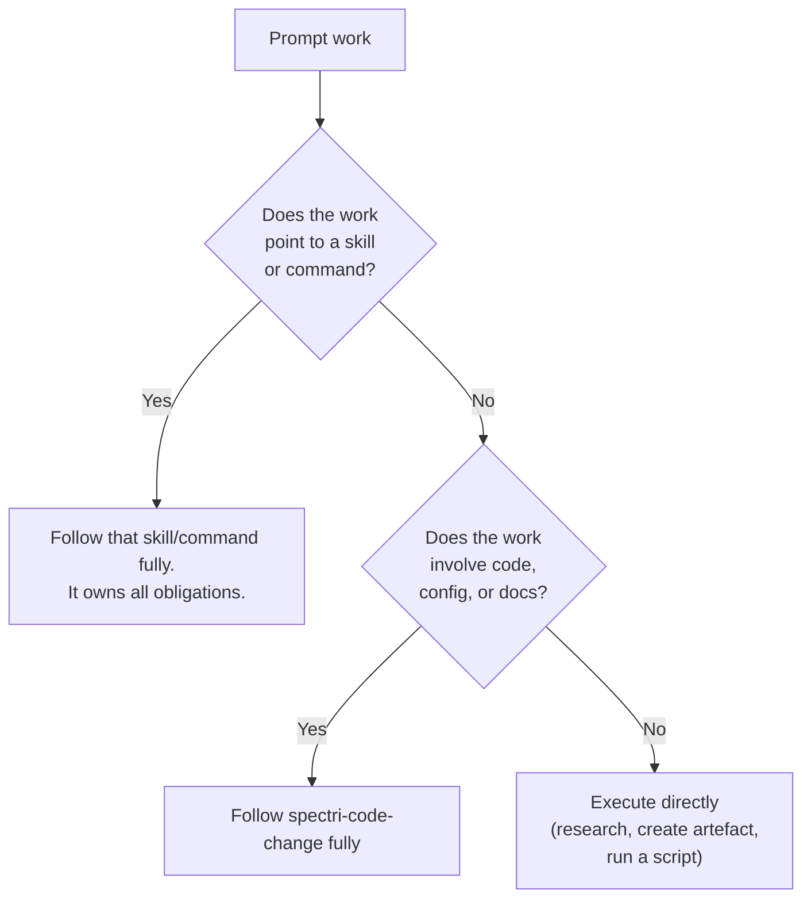
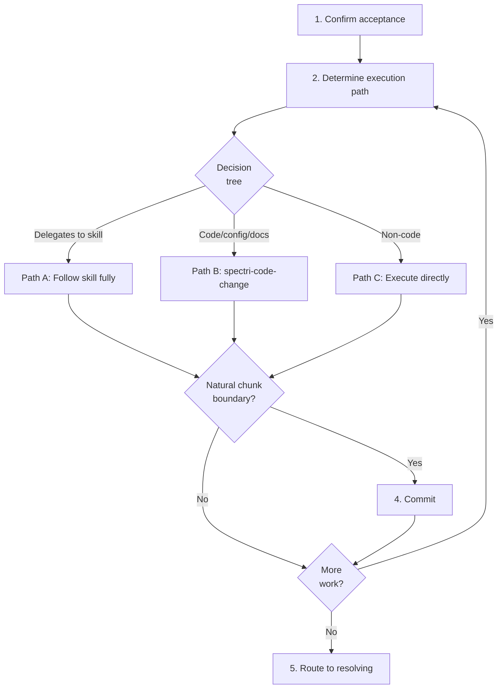

# Implementing a Prompt

## Guiding Principles

### The prompt describes what, skills describe how

The prompt tells you what needs to happen. If the work involves code, config, or docs, the `spectri-code-change` skill (or another delegated skill) owns the obligations for how it gets done. Follow the prompt for scope, follow the skill for execution.

### Scope containment

If you discover unrelated problems while implementing, capture them as separate issues. Do not expand the prompt's scope mid-execution.

### Commit at natural boundaries

Do not accumulate large changesets. Commit at natural chunk boundaries — the smallest coherent piece of work that makes sense on its own.

## Steps

<IMPORTANT>
**Before starting work on the steps below:**

1. Read the detailed instructions for each step in the sections that follow
2. Create a TodoWrite item for every step in this list

**MUST NOT modify this file to check off steps.**
</IMPORTANT>

- [ ] 1. Confirm acceptance is complete
- [ ] 2. Determine execution path
- [ ] 3. Execute the work
- [ ] 4. Commit at natural boundaries
- [ ] 5. When all work is done — route to resolving

### Step 1: Confirm acceptance is complete

Verify you have completed the accepting workflow (`accepting-a-prompt.md`). You must be able to state what the prompt asks for, what the expected output looks like, and what constraints apply.

If you skipped acceptance (e.g. you wrote the prompt yourself and are now implementing it), confirm your own understanding meets the same bar.

### Step 2: Determine execution path

For the prompt's work, determine which path applies:

**Path A — Work delegates to a skill or command:**
Run that skill or command. The skill handles everything: spec lookup, tests, review, commit bundle. When the skill completes, return here.

**Path B — Work involves code/config/docs without a named skill:**
Follow `spectri-code-change` obligations. This means: identify the governing spec (if any), write a test (if code), make the change, review with sub-agents, update callers, run tests, update the spec if behaviour changed, build/sync if deployed files affected.

**Path C — Work is non-code:**
Execute directly. This covers research tasks, artefact creation, running scripts, or other work that doesn't produce code changes.

| Excuse | Reality |
|--------|---------|
| "The prompt said to do X so I skipped the skill's steps" | The skill is authoritative, not the prompt. Follow the skill fully. |
| "I found a related problem so I fixed it too" | Scope creep. Capture with `/spec.issue` and stay on the prompt. |
| "I don't need a governing spec check — it's just a prompt" | Path B still requires spec lookup. Prompts don't exempt you from code-change obligations. |

### Step 3: Execute the work

Follow the execution path determined in Step 2. If the prompt covers multiple pieces of work, execute them in order, committing at natural boundaries.

### Step 4: Commit at natural boundaries

Commit per natural chunk of work. What belongs in each commit:

- The code/config/docs changes for this chunk
- Updated tests for changed code
- Spec update if this chunk changed documented behaviour
- Implementation summary if a spec was updated

### Step 5: When all work is done — route to resolving

When the prompt's work is complete, proceed to `resolving-a-prompt.md` to close out the prompt.

If you are approaching context limits before all work is done, create a thread using the `spectri-threads` skill immediately. Include: what work is complete (with commit hashes), what remains, and any blockers. You do not need to complete the entire prompt in one session.

<HARD-GATE>
Do not end your session without either resolving the prompt or creating a thread with handoff notes for the next agent. Unresolved prompts without continuation context get lost.
</HARD-GATE>

**Terminal state:** All prompt work executed and committed. Prompt routed to `resolving-a-prompt.md`.

## Workflow Diagram

