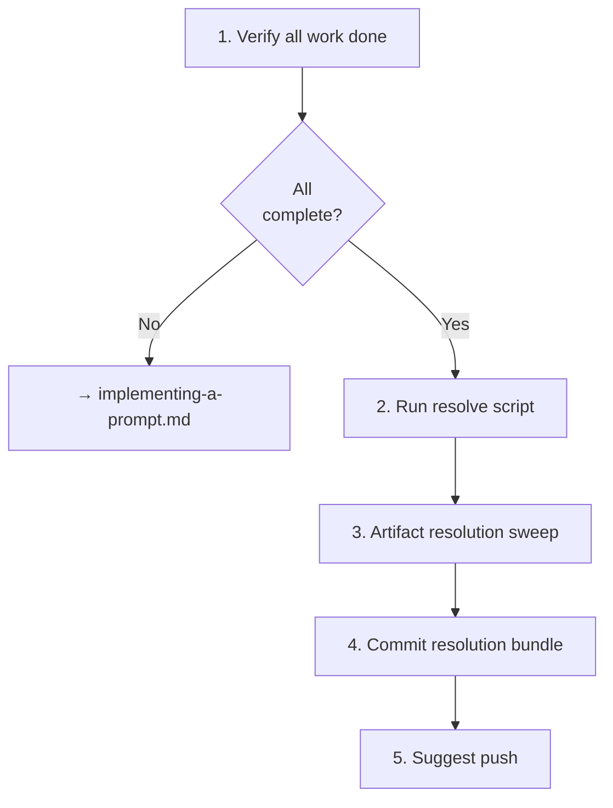

# Resolving a Prompt

## Guiding Principles

### Resolve immediately, not later

Deferred resolution gets missed. When the prompt's work is complete, resolve it in the same session. Do not leave it for a future agent.

### Multi-item prompts: only resolve when ALL items are done

If a prompt covers multiple tasks, only resolve when every task is complete. Partially-done prompts remain open.

## Steps

<IMPORTANT>
**Before starting work on the steps below:**

1. Read the detailed instructions for each step in the sections that follow
2. Create a TodoWrite item for every step in this list

**MUST NOT modify this file to check off steps.**
</IMPORTANT>

- [ ] 1. Verify all prompt work is done
- [ ] 2. Run resolve script
- [ ] 3. Artifact resolution sweep
- [ ] 4. Commit the resolution bundle
- [ ] 5. Suggest push

### Step 1: Verify all prompt work is done

Review the prompt file and your TodoWrite items. All work described in the prompt must be complete.

If work remains, go back to `implementing-a-prompt.md` and finish it.

If work was intentionally skipped, document why before proceeding.

### Step 2: Run resolve script

```bash
bash .spectri/scripts/spectri-trail/resolve-prompt.sh <prompt-file> --status <implemented|superseded>
```

| Status | When |
|--------|------|
| `implemented` | Prompt work was fully executed |
| `superseded` | Replaced by a different approach or prompt |

Optional: `--notes "brief resolution summary"` to add resolution notes to frontmatter.

The script updates frontmatter status fields and moves the file to `resolved/` via `git mv` (auto-staged).

<HARD-GATE>
After running the resolve script, verify with `git status` that the file move (deletion from active location + addition in `resolved/`) is staged. Do not proceed until both are staged.
</HARD-GATE>

### Step 3: Artifact resolution sweep

Check for other open artifacts that reference this prompt or its related work:

- Threads in `spectri/coordination/threads/` that were created during implementation
- Plans that include this prompt's work as a step
- Issues that were filed during implementation and are now resolved

Resolve matching artifacts using their respective resolve scripts. Only resolve multi-item artifacts when ALL items are done.

### Step 4: Commit the resolution bundle

Stage everything and commit:

- The resolved prompt file (moved to `resolved/`)
- Any artifacts resolved in the sweep

```
docs(prompt): resolve <slug> — <brief outcome>
```

### Step 5: Suggest push

Ask the user if they'd like to push to remote now.

**Terminal state:** Prompt resolved, committed, pushed.

## Workflow Diagram


