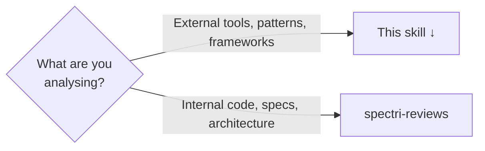

# Spectri Research

External-facing investigation of tools, libraries, frameworks, patterns, or technologies outside the current codebase.



## Before Creating a File

Ask: "Do you want a research report saved to the project, or just an answer in the chat?"

Quick questions deserve chat answers. Investigations that will inform future decisions deserve a file.

## Research Process

1. **Define questions** — what specific questions need answering?
2. **Investigate** — gather findings systematically
3. **Analyse** — interpret findings, identify trade-offs, note limitations
4. **Recommend** — action to take (adopt, defer, reject, or monitor)

## Creating a Research File

```bash
bash .spectri/scripts/spectri-trail/create-research.sh --title "Topic" [--type architectural]
```

The script creates `spectri/research/YYYY-MM-DD-topic-research.md` with correct frontmatter and stages it. Follow `references/research-template.md` for body structure.

Types: `architectural`, `tooling`, `pattern`, `integration`, or any custom value.

Update frontmatter `status` as you progress: `stub` → `in-progress` → `complete`.

## Research Packages

For multi-source investigations (comparative analysis, technology surveys) that naturally produce multiple related files, use a research package instead of a single file.

```bash
bash .spectri/scripts/spectri-trail/create-research.sh --title "Topic" --package [--type tooling]
```

This creates `spectri/research/YYYY-MM-DD-topic/00-index.md` — a folder with an index file as the entry point. Add numbered files within the package (e.g., `01-findings.md`, `02-comparison.md`) and update the Package Contents table in `00-index.md`.

**When to use packages vs single files:**
- **Single file** — one investigation, one set of findings
- **Package** — multiple related investigations that share context and need a synthesised overview

## Quality Review

When persisting a research file (not chat-only answers), launch 3 sub-agents to review the document before committing. See `references/quality-review.md` for review scopes (answer quality, evidence quality, relevance) and agent-specific instructions.

Each reviewer simulates being the decision-maker who will act on these research findings.

<HARD-GATE>
Do not commit the research until all review feedback is addressed. Loop on feedback: agree and fix, disagree and explain, or escalate to the user. Chat answers skip this gate.
</HARD-GATE>

## Committing

Stage and commit the research file. If the research also drove code changes, follow the commit bundle obligations in `spectri-code-change`.

**Terminal state:** Research note committed with findings, recommendations, and quality review passed, or question answered in chat.
