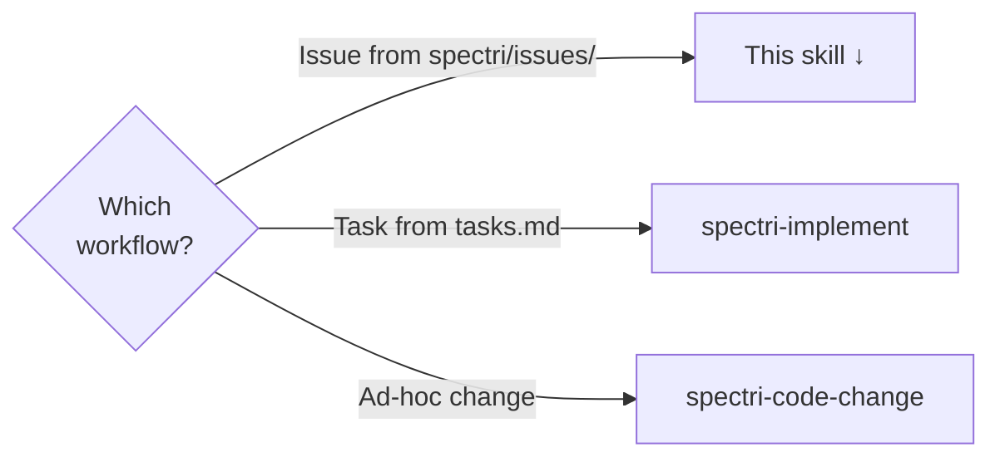
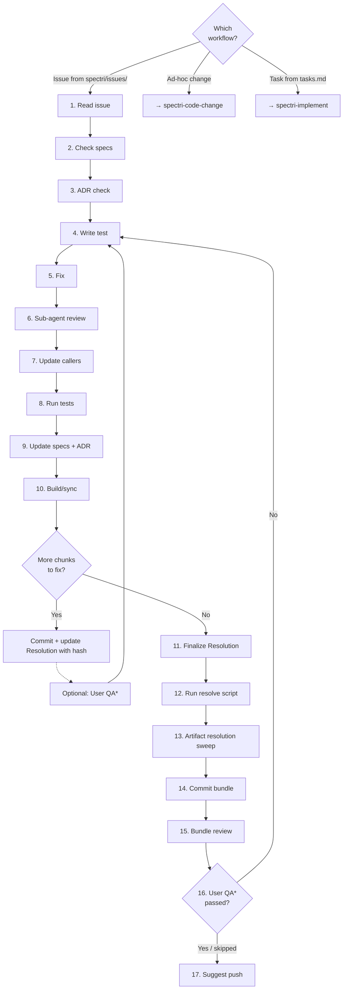

# Resolve Issue

Full lifecycle from reading an open issue to committing its resolution. Only applies when an issue file exists in `spectri/issues/` — for ad-hoc code fixes without a tracked issue, see the `spectri-code-change` skill.

This skill owns the entire workflow. There is no `/spec.resolve-issue` command — resolution uses `.spectri/scripts/spectri-quality/resolve-issue.sh` directly.

## Which Workflow?

<HARD-GATE>
If the work is ad-hoc without a tracked issue, use `spectri-code-change` instead. If the work is a planned task from `tasks.md`, use `spectri-implement` instead.
</HARD-GATE>

Each branch routes to the skill that handles that type of work:

## Guiding Principles

### Smallest piece of work

Commit and test early, commit and test often. Don't accumulate dozens of file changes — break work into regular commits with only a few files each. A resolved issue should be a trail of small commits, not one massive changeset.

What to include in each intermediate commit:

- The code changes for this chunk
- Updated tests for the changed code
- Spec update if this chunk changed behaviour documented in a spec
- `/spec.summary` if a spec was updated in this commit
- Update `## Resolution` in the issue file with the commit hash and a brief note of what this chunk did

What NOT to include in intermediate commits:

- The resolved issue file (that lands in the final commit only)
- Unrelated changes discovered along the way (capture with `/spec.issue`)

If creating a plan for a large issue, include regular commit points in the plan.

**Do:**
- ✅ Commit after fixing a discrete piece of the issue
- ✅ Include affected spec + summary when behaviour changed
- ✅ Keep each commit to a few files
- ✅ Capture unrelated discoveries as separate issues

**Don't:**
- ❌ Accumulate 20+ file changes before committing
- ❌ Defer spec updates to "do later"
- ❌ Bundle everything into one final commit
- ❌ Expand scope mid-fix

### The final commit is a complete bundle

The commit that resolves the issue MUST include everything needed to close the loop — see Step 14 for the full bundle checklist.

Intermediate commits during the work carry their own spec obligations but don't include the resolved issue — that lands at the end.

### Workflow-skipping rationalisations

If you catch yourself thinking any of these, you are about to skip the workflow. Stop.

| Thought | Counter |
|---------|---------|
| "I know how to do this" | Knowing how is not the same as following the workflow. The workflow catches what you miss. |
| "It's just a quick fix" | Quick fixes are the most common source of skipped workflows and incomplete bundles. |
| "I'll resolve the issue in a separate commit" | The resolved issue MUST be in the same final commit as the fix. That is the bundle. |
| "I don't need the find-related-specs script" | The script finds specs you don't know about. Skipping it means missing governing specs. |
| "I'll do the artifact sweep later" | Deferred sweeps get missed. Do it now while context is fresh. |
| "The user just wants this fixed" | The user wants a reliable, traceable fix. The workflow provides that. |

## Steps

<IMPORTANT>
**Before starting work on the steps below:**

1. Read the detailed instructions for each step in the sections that follow
2. Read and understand the workflow diagram at the end of the step details
3. Create a TodoWrite item for every step in this list

**MUST NOT modify this file to check off steps.**
</IMPORTANT>

- [ ] 1. Read the issue file
- [ ] 2. Check for any related specs
- [ ] 3. Check if ADR is needed
- [ ] 4. Write failing test (Red)
- [ ] 5. Make the fix (Green)
- [ ] 6. Review fix with sub-agents
- [ ] 7. Update callers if signatures changed
- [ ] 8. Run tests
- [ ] 9. Update affected spec(s) if behaviour changed
- [ ] 10. Build/sync if deployed files affected
- [ ] 11. Finalize Resolution section
- [ ] 12. Run resolve script
- [ ] 13. Artifact resolution sweep
- [ ] 14. Commit
- [ ] 15. Bundle review with sub-agents
- [ ] 16. User QA if needed*
- [ ] 17. Suggest push to remote

### Step 1: Read the issue file

Read the entire issue file. Understand the full problem before touching code.

If `blocked: true` appears in frontmatter, resolve the blocker first or ask the user before proceeding.

<HARD-GATE>
Do not proceed until you understand what the issue describes and what the expected resolution looks like. If anything is ambiguous or incomplete, ask the user for clarification.
</HARD-GATE>

### Step 2: Check for any related specs

Run `bash .spectri/scripts/spectri-workflow/find-related-specs.sh --file <issue-file>` to discover governing specs. The script checks `related_specs` in frontmatter, extracts `related_files`, searches issue body for file paths, and greps spec content for matches.

Review the script's output: "Already listed" specs are confirmed; "Newly discovered" specs need your judgement on whether they're governing. If you find governing specs not listed in `related_specs`, update the issue frontmatter now — you'll need this at step 9 and the frontmatter is the persistent record.

If the issue contradicts a spec, 🛑 stop and confirm with the user before proceeding — the spec may need updating or the issue may be invalid.

### Step 3: Check if ADR is needed

If the fix involves a significant architectural change, ask the user whether to create an ADR (`/spec.adr`) before proceeding with the implementation.

### Step 4: Write failing test (Red)

If the fix involves code: write or update a test that fails because of the reported bug. The test MUST describe the expected behaviour and fail for the right reason.

For multi-commit issues, write only the test(s) for the chunk you're about to fix — not every test for the entire issue.

If the fix is documentation, config, or a non-code change, skip to step 5.

### Step 5: Make the fix (Green)

Make the smallest change that resolves the issue. May be code, documentation, spec correction, or config.

Keep scope contained to what the issue describes. If you discover related problems, capture them as separate issues with `/spec.issue` — do not expand scope.

| Excuse | Reality |
|--------|---------|
| "It's a one-line fix while I'm here" | One-line scope creep is still scope creep. Capture it with `/spec.issue`. |
| "It's related to the same area" | Related problems get related issues, not bundled fixes. |

### Step 6: Review fix with sub-agents

If the fix involved code changes, launch 2 sub-agents in parallel to review the diff. Each receives:

- The issue file (for context on what was being fixed)
- The changed files (`git diff` of unstaged changes, or `git diff HEAD` if already staged)

Instruction to each sub-agent: "Review this code change against the issue it resolves. Check:

- **Correctness**: Does the change fix the reported problem? Are there edge cases or failure modes?
- **Brevity**: Could the same result be achieved with less code?
- **Structure**: Should any of this be split into separate files, functions, or modules?
- **Best practices**: Does the code follow the project's conventions and language idioms?
- **Side effects**: Could this change break anything not covered by the issue?"

Evaluate their feedback:

- **Agree**: Apply the fix and note what changed
- **Disagree**: Explain why and move on
- **Unclear**: Ask the user to decide

For docs-only or config-only fixes, skip to step 7.

### Step 7: Update callers if signatures changed

If you modified any function signature, return type, or interface, run `bash .spectri/scripts/spectri-workflow/find-callers.sh --names <changed-names> --exclude <definition-file>` to find all callers. The script searches the project for references, excluding common directories (.git, node_modules, etc.) and the definition file you specify. You MUST update all reported callers before proceeding.

<CRITICAL>
When multiple callers changed, commit the caller updates before continuing. Do not leave callers broken across commits.
</CRITICAL>

### Step 8: Run tests

If you changed code, run the project's test suite (e.g. `uv run pytest`, `npm test`, `cargo test`). All tests MUST pass before proceeding. For docs-only or config-only fixes, skip to step 9.

| Excuse | Reality |
|--------|---------|
| "Tests were already failing" | Note pre-existing failures explicitly. Your changes MUST NOT introduce new failures. |
| "I'll fix the tests later" | Later never comes. Fix now or stop and ask the user. |

### Step 9: Update affected spec(s) if behaviour changed

If any of your changes altered behaviour documented in a spec, update those specs to reflect the new reality.

For each spec that needs updating:

1. Update `spec.md` with revised FRs/criteria
2. `git add` the spec immediately
3. Run `/spec.summary`
4. Run `/spec.update-meta`

<CRITICAL>
Stage the spec update BEFORE running `/spec.summary`. The summary reads staged changes — if the spec is unstaged, the summary misses it.
</CRITICAL>

This applies to both intermediate and final commits — run `/spec.summary` every time you update a spec.

If no governing spec exists and the change is significant, ask the user whether to create a prompt for a separate agent to run `/spec.retro` (creates a retrospective spec for undocumented behaviour).

If you created an ADR at step 3, revisit it now. Update it with actual decisions, trade-offs, and outcomes from implementation — the pre-implementation ADR captured intent; the post-implementation update captures reality.

### Step 10: Build/sync if deployed files affected

If the fix touched source files that require a build or sync step, run it now to update deployed copies.

### Step 11: Finalize Resolution section

Complete `## Resolution` in the issue file. For multi-commit issues, you've been adding commit hashes and notes as you go — now tidy and complete it.

Keep it concise — the git log already records file-level detail. Resolution captures:

| Section | Content |
|---------|---------|
| Problem | Root cause, not symptoms |
| What was done | Brief summary — don't duplicate the commit log |
| What was verified | Tests run, manual checks performed |

### Step 12: Run resolve script

Run `.spectri/scripts/spectri-quality/resolve-issue.sh <issue-file>`.

The script sets `status: resolved`, updates `closed` date, and moves the file to `spectri/issues/resolved/`.

<HARD-GATE>
After running the resolve script, verify with `git status` that the file move (deletion from `spectri/issues/` + addition in `spectri/issues/resolved/`) is staged. Do not proceed until both are staged.
</HARD-GATE>

### Step 13: Artifact resolution sweep

Run `bash .spectri/scripts/spectri-workflow/find-related-artifacts.sh --file <issue-file>` to find threads, prompts, and LLM plans referencing this issue or its related specs. The script reports each artifact's status and whether it's safe to resolve (all referenced issues closed).

Review the script's output and resolve matching artifacts using scripts in `.spectri/scripts/spectri-trail/` — pass `--status` flag to avoid interactive prompts. Only resolve multi-item artifacts when ALL items are done. See `spectri/SPECTRI.md` for the full resolution lifecycle.

| Excuse | Reality |
|--------|---------|
| "No artifacts reference this issue" | Check, don't assume. Search for the issue filename and related spec names. |
| "I'll clean up artifacts separately" | Artifacts resolved in a later session get missed. Do it now while context is fresh. |

### Step 14: Commit

Before committing, run `bash .spectri/scripts/spectri-workflow/verify-commit-bundle.sh --mode resolve-issue --file <issue-file>` to verify your staged changes form a complete bundle. If any required check fails (exit 3), stage the missing pieces before committing.

This is the final commit — the complete bundle. Stage everything:

- ✅ The code fix (and tests)
- ✅ Resolved issue file (moved to `resolved/` by the resolve script)
- ✅ Spec update(s) if behaviour changed
- ✅ `/spec.summary` if a spec was updated
- ✅ ADR update if one was created at step 3
- ✅ Artifact resolution sweep results

| Excuse | Reality |
|--------|---------|
| "I'll commit the fix now and resolve the issue later" | The fix and the resolved issue MUST be in the same final commit. |
| "I'll do the summary in a separate commit" | The summary is part of the final bundle. One commit. |
| "I'll clean up artifacts in a separate commit" | Artifacts are part of the bundle. Resolve them now. |

### Step 15: Bundle review with sub-agents

Before presenting to the user for QA, launch 3 sub-agents in parallel to review the committed bundle. Each receives the full `git diff` of the final commit and the list of staged files.

**Sub-agent 1 — Code quality review:**
Review the full diff for correctness, brevity, structure, best practices, and side effects. Same criteria as step 6, but applied to the final committed state.

**Sub-agent 2 — Bundle completeness review:**
Check the commit includes all required artifacts:
- Code + tests
- Resolved issue file (in `resolved/`)
- Spec update (if behaviour changed) + `/spec.summary`
- ADR update (if one was created)
- Artifact resolution sweep completed
- No stray unstaged files that should have been included

**Sub-agent 3 — Build/sync correctness review:**
If build/sync was run (step 10), verify deployed files match source. If build/sync was not needed, confirm no deployed files were accidentally edited directly.

Evaluate feedback: agree and fix (new commit — do not amend), disagree and explain, or escalate to user.

### Step 16: User QA if needed

If the fix warrants user verification, ask now — after the bundle review but before pushing.

If QA reveals problems:

1. The committed bundle stands — do not amend it
2. Loop back through steps 4–10 as a new commit cycle
3. That follow-up commit may itself need QA

In most cases, user QA won't be required.

### Step 17: Suggest push to remote

Ask the user if they'd like to push to remote now.

**Terminal state:** issue resolved, committed, and pushed. If you missed capturing an unrelated problem with `/spec.issue` during step 5, create it now before ending the session.

## Workflow Diagram

\* In most cases, user QA won't be required.

