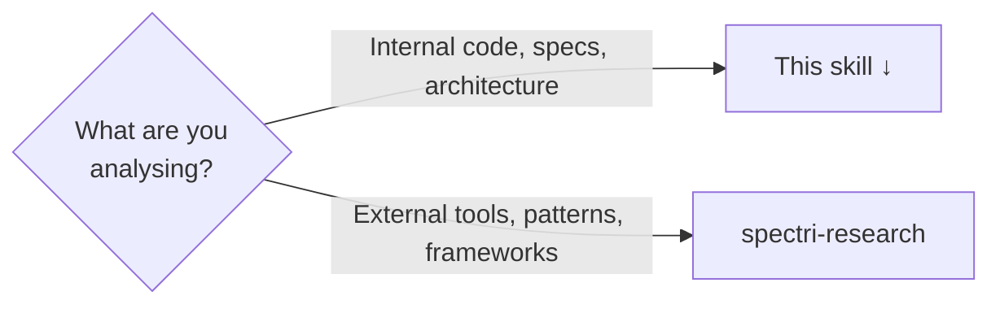

# Spectri Reviews

Internal-facing analysis of existing code, specs, architecture, or another agent's work.



## Before Creating a File

Ask: "Do you want a review file saved, or just feedback in the chat?"

Recommend based on review type:

| Review type | Recommendation |
|-------------|----------------|
| Quick code feedback | Chat |
| Architecture review | File |
| Pre-implementation gate | File |
| Spec readiness check | File |

## Identify the Review Type

Select the correct type before writing. For body structure per type, follow `references/review-template.md`.

| Type | Use for |
|------|---------|
| `architecture` | System design, component organization, coupling |
| `code-quality` | Maintainability, readability, technical debt |
| `spec` | Clarity, completeness, readiness for implementation |
| `system-enhancement` | Cross-cutting improvements across multiple areas |
| `onboarding` | Evaluate project documentation for new agents |
| `historical-analysis` | Extract decisions and patterns from git history |
| `pre-implementation-gate` | Assess spec readiness before implementation |
| `comparative-analysis` | Compare before/after states or against baselines |

## Creating a Review File

```bash
bash .spectri/scripts/spectri-trail/create-review.sh --title "Title" --type <type> [--source <path>]
```

The script creates `spectri/coordination/reviews/YYYY-MM-DD-title-review.md` with correct frontmatter. Follow `references/review-template.md` for body structure.

Reviews have no resolve lifecycle — they are reference documents, not work items.

## Quality Review

When persisting a review file (not chat-only feedback), launch 3 sub-agents to review the document before committing. See `references/quality-review.md` for review scopes (insight value, evidence quality, completeness) and agent-specific instructions.

Each reviewer simulates being the reader who will use this review to make decisions.

<HARD-GATE>
Do not commit the review until all review feedback is addressed. Loop on feedback: agree and fix, disagree and explain, or escalate to the user. Chat-only reviews skip this gate.
</HARD-GATE>

## Committing

Stage and commit the review file. If the review also drove code changes, follow the commit bundle obligations in `spectri-code-change`.

**Terminal state:** Review file committed with type-appropriate body structure and quality review passed, or feedback provided in chat.
