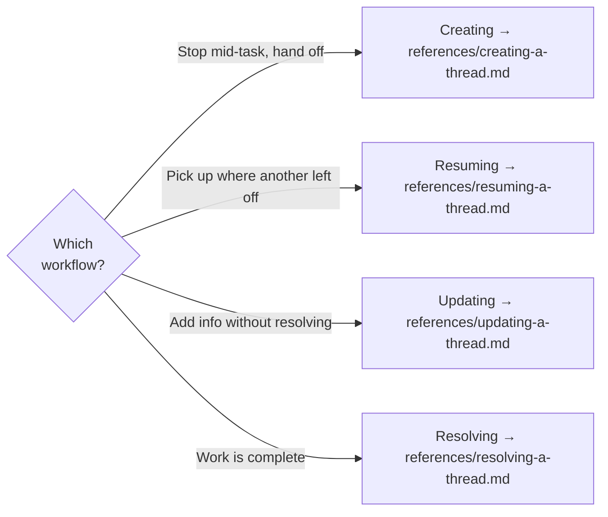
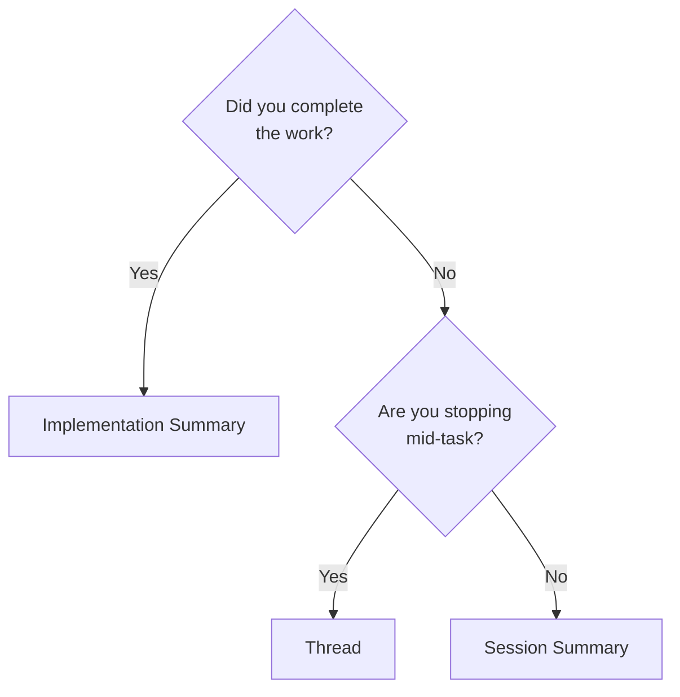

# Spectri Threads

Continuation context for unfinished work, enabling multi-agent handoffs.

## Key Principle — Capture What REMAINS, Not What HAPPENED

<CRITICAL>
Threads are NOT session logs and NOT for completed work. A thread captures what remains to be done — unfinished business, open questions, decisions pending, and next actions — so a zero-context agent can resume. Use implementation summaries for completed work.
</CRITICAL>

## For Resuming Agents

When a user says "continue with X" or references previous work:

1. Check `spectri/coordination/threads/` for active threads in the relevant context
2. Read the most recent `.md` file (exclude `resolved/` subdirectories)
3. Execute the **Next Actions** from the thread
4. Resolve the thread when work completes (see `references/resolving-a-thread.md`)

For the full resuming workflow, see `references/resuming-a-thread.md`.

## Which Workflow?

Identify which workflow applies and read the corresponding reference file before starting.

| Workflow | When | Reference |
|----------|------|-----------|
| **Creating** | Stopping mid-task and need to capture continuation context for handoff | `references/creating-a-thread.md` |
| **Resuming** | Picking up an existing thread — another agent left handoff notes | `references/resuming-a-thread.md` |
| **Updating** | Adding information to an existing thread without resolving it | `references/updating-a-thread.md` |
| **Resolving** | Work described in the thread is complete | `references/resolving-a-thread.md` |

## Thread vs Implementation Summary vs Session Summary

| Type | Purpose | When created | Focus |
|------|---------|--------------|-------|
| **Thread** | Continuation context | Stopping mid-task | What REMAINS to be done |
| **Implementation Summary** | Phase completion record | After finishing a phase | What WAS completed |
| **Session Summary** | Session recap | End of session (no unfinished work) | What HAPPENED in session |

## Context Types

Threads are organised by context — the scope of the work they relate to.

| Context | When | Directory |
|---------|------|-----------|
| `constitution` | Project setup, principles, constitution.md changes (before specs exist) | `spectri/coordination/threads/constitution/` |
| `spec-specific` | Work tied to a specific feature/spec (requires spec identifier, format: `NNN-feature-name` e.g. `033-thread-module`) | `spectri/coordination/threads/<NNN-spec-name>/` |
| `general` | Cross-cutting work not tied to a specific spec or constitution | `spectri/coordination/threads/general/` |
