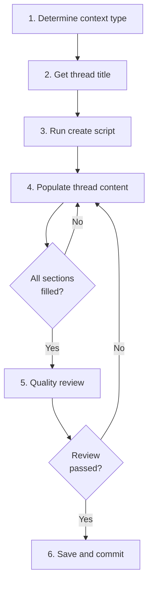

# Creating a Thread

## Guiding Principles

### Capture enough for zero-context resumption

The resuming agent has never seen your session. The thread must contain enough context — what was being attempted, what remains, open questions, decisions pending, and specific next actions — for a cold start. Include commit hashes for completed work.

### Threads capture what REMAINS, not what HAPPENED

A thread is not a session log. Focus on unfinished business, open questions, and next actions. Completed work belongs in implementation summaries.

### Every thread ends with a TODO marker

The `## TODO` section is a greppable marker that makes threads discoverable.

## Steps

<IMPORTANT>
**Before starting work on the steps below:**

1. Read the detailed instructions for each step in the sections that follow
2. Create a TodoWrite item for every step in this list

**MUST NOT modify this file to check off steps.**
</IMPORTANT>

- [ ] 1. Determine context type
- [ ] 2. Get thread title
- [ ] 3. Run create script
- [ ] 4. Populate thread content
- [ ] 5. Quality review
- [ ] 6. Save and commit

### Step 1: Determine context type

Ask the user or infer from current work:

| Context | When | Spec identifier needed? |
|---------|------|------------------------|
| `constitution` | Project setup, principles, constitution.md changes | No |
| `spec-specific` | Work tied to a specific feature/spec | Yes — format: `NNN-feature-name` |
| `general` | Cross-cutting work not tied to a specific spec | No |

For `spec-specific`: auto-detect from current directory if inside `spectri/specs/NNN-*/`, or ask: "Which spec is this work related to?"

### Step 2: Get thread title

Ask the user: "What short title describes this unfinished work? (3-7 words)"

The title should describe the unfinished work state, not the completed work. Examples:
- "Update plan command improvements" (good — describes what's in progress)
- "Finished plan command" (bad — completed work doesn't need a thread)

### Step 3: Run create script

```bash
bash .spectri/scripts/spectri-trail/create-thread.sh \
  --title "$TITLE" \
  --context <constitution|spec-specific|general> \
  [--spec "$SPEC_IDENTIFIER"]
```

| Flag | Required | Notes |
|------|----------|-------|
| `--title` | Yes | 3-7 word description of unfinished work |
| `--context` | Yes | `constitution`, `spec-specific`, or `general` |
| `--spec` | For spec-specific | Spec identifier e.g. `033-thread-module` |
| `--json` | No | Output created path as JSON |

The script creates the thread file with correct frontmatter and stages it.

### Step 4: Populate thread content

Open the created file and fill in ALL template sections. Each section captures a different dimension of continuation context:

**What Was Being Attempted** (2-3 sentences): Brief context about the work in progress. Include the goal and current state.

**Unfinished Business** (bulleted list): Specific remaining tasks or steps not yet completed. Be granular — each bullet should be actionable.

**Open Questions** (bulleted list): Questions that arose but weren't answered. These help the resuming agent understand what needs investigation.

**Decisions Pending** (bulleted list): Choices waiting on user input or clarification. Include the options if known.

**Next Actions** (ordered list, most urgent first): Specific first steps for whoever picks up this thread. Start with the very next thing to do.

**TODO** (greppable marker): A `## TODO` section. May contain specific items or simply "Work with user to complete the work described above."

#### Example content

```markdown
## What Was Being Attempted
Adding automatic change detection to `/spec.update-plan` by diffing
spec.md changes since last plan update. Goal: reduce manual effort
when extending specs by auto-suggesting plan.md updates.

## Unfinished Business
- Parse spec.md diff to identify new user stories
- Map changes to plan.md sections
- Add validation to ensure plan stays in sync with spec

## Open Questions
- Should we use timestamp-based or hash-based change detection?
- How to handle semantic changes vs formatting changes?

## Decisions Pending
- User needs to decide: auto-detection or keep manual approach?
- Priority: should this block tasks.md generation?

## Next Actions
1. Get user decision on approach (Option A: timestamp vs Option B: hash)
2. If approved, implement hash-based tracking in plan.md frontmatter
3. Test with real spec extension scenario

## TODO
- Get user decision on auto-detection approach
- Implement chosen approach and test
```

<HARD-GATE>
Do not commit a thread with empty template sections. Every section must contain specific, actionable information. A thread with "TBD" placeholders fails its purpose — the resuming agent needs real context.
</HARD-GATE>

### Step 5: Quality review

Launch 3 sub-agents to review the thread before committing. See `quality-review.md` for review scopes (resumability, relevance, actionability) and agent-specific instructions.

Each reviewer simulates being an agent picking up this thread cold to resume the work.

<HARD-GATE>
Do not commit the thread until all review feedback is addressed. Loop on feedback: agree and fix, disagree and explain, or escalate to the user.
</HARD-GATE>

### Step 6: Save and commit

Stage and commit the thread:

```
docs(thread): create <slug> — <context type>
```

Report the thread location to the user so they can reference it when starting the next session.

**Terminal state:** Thread committed with complete continuation context. Ready for another agent to resume.

## Workflow Diagram


