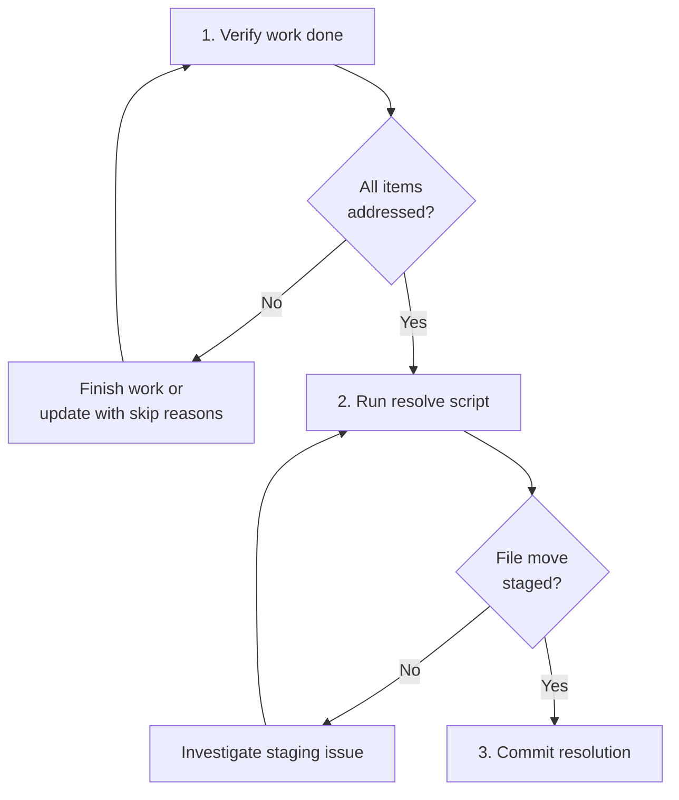

# Resolving a Thread

## Guiding Principles

### Resolve immediately when work completes

Deferred resolution gets missed. When the work described in a thread is complete, resolve it in the same session. Do not leave it for a future agent.

### Resolution status reflects outcome

Use `completed` when the thread's work was done. Use `superseded` when a newer approach replaces the work the thread described.

## Steps

<IMPORTANT>
**Before starting work on the steps below:**

1. Read the detailed instructions for each step in the sections that follow
2. Create a TodoWrite item for every step in this list

**MUST NOT modify this file to check off steps.**
</IMPORTANT>

- [ ] 1. Verify thread work is done
- [ ] 2. Run resolve script
- [ ] 3. Commit the resolution

### Step 1: Verify thread work is done

Review the thread file. All items in **Unfinished Business** should be addressed. All **Next Actions** should be completed or explicitly no longer needed.

If work remains, go back to the relevant work skill and finish it. Or update the thread with why remaining items were skipped.

### Step 2: Run resolve script

```bash
bash .spectri/scripts/spectri-trail/resolve-thread.sh <thread-file> \
  --status <completed|superseded> \
  [--notes "completion notes"] \
  [--processed-by "agent session id"]
```

| Flag | Required | Notes |
|------|----------|-------|
| `<thread-file>` | Yes | Full path, relative path, or filename (searches all directories) |
| `--status` | Yes | `completed` or `superseded` |
| `--notes` | No | Brief summary of what was completed |
| `--processed-by` | No | Agent session identifier for audit trail |

The script updates frontmatter with resolution metadata and moves the file to a `resolved/` subdirectory via `git mv` (auto-staged).

<HARD-GATE>
After running the resolve script, verify with `git status` that the file move is staged. Do not proceed until the deletion and addition are both staged.
</HARD-GATE>

### Step 3: Commit the resolution

Stage any remaining changes and commit:

```
docs(thread): resolve <slug> — <status>
```

Include resolution notes in the commit message if the thread covered significant work.

**Terminal state:** Thread resolved, moved to `resolved/`, committed.

## Workflow Diagram


