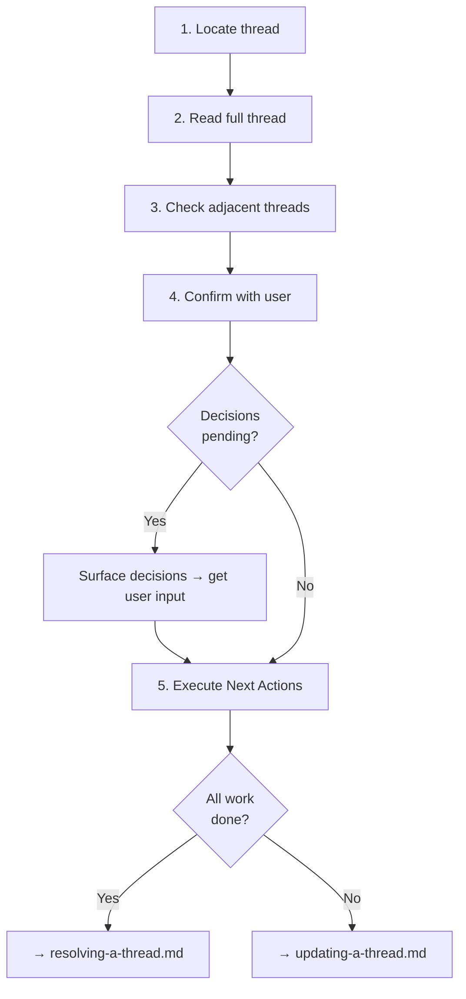

# Resuming from a Thread

## Guiding Principles

### The thread is your briefing document

When a user says "continue with X" or references previous work, check for active threads first. The thread contains everything the previous agent wanted you to know.

### Execute Next Actions in order

The previous agent prioritised the Next Actions list. Start with item 1 unless the user directs otherwise.

### Check adjacent threads

For spec-specific work, check the spec's thread directory for other active threads. Multiple agents may have left context about different aspects of the same spec.

## Steps

<IMPORTANT>
**Before starting work on the steps below:**

1. Read the detailed instructions for each step in the sections that follow
2. Create a TodoWrite item for every step in this list

**MUST NOT modify this file to check off steps.**
</IMPORTANT>

- [ ] 1. Locate the thread
- [ ] 2. Read the full thread
- [ ] 3. Check for adjacent threads
- [ ] 4. Confirm understanding with user
- [ ] 5. Execute Next Actions
- [ ] 6. Resolve or update the thread

### Step 1: Locate the thread

Find the relevant thread. Search strategies:

```bash
# List all active threads for a spec
ls -lt spectri/coordination/threads/<spec-number>*/*.md

# Find all active threads across all contexts (excluding resolved/)
find spectri/coordination/threads -type d -name "resolved" -prune -o -name "*.md" -not -name "SPECTRI.md" -not -name "CLAUDE.md" -not -name "AGENTS.md" -not -name "GEMINI.md" -not -name "QWEN.md" -type f -print

# Search by keyword
grep -rl "keyword" spectri/coordination/threads/ --include="*.md"
```

### Step 2: Read the full thread

Read the entire thread file.

<HARD-GATE>
Do not proceed if the thread file has unfilled template sections or appears corrupted. Report the issue to the user — a malformed thread will waste an entire session.
</HARD-GATE>

Pay attention to:
- **What Was Being Attempted** — understand the goal
- **Unfinished Business** — understand the remaining scope
- **Open Questions** — these need answers before proceeding
- **Decisions Pending** — these need user input
- **Next Actions** — your starting point

### Step 3: Check for adjacent threads

For spec-specific work, check the same spec directory for other active threads. Multiple threads about the same spec indicate concurrent or sequential work streams that may interact.

For general work, check if other threads reference the same files, plans, or issues.

### Step 4: Confirm understanding with user

State what the thread describes and what you plan to do. The user can correct misunderstandings or re-prioritise before work begins.

If the thread has **Decisions Pending**, surface those first — they may block Next Actions.

### Step 5: Execute Next Actions

Follow the Next Actions list from the thread. As you work:

- Use the appropriate skill for each action (spectri-code-change for code, spectri-resolve-issue for issues, etc.)
- Commit at natural boundaries
- If you discover the thread's context is outdated, update it (see `updating-a-thread.md`)

### Step 6: Resolve or update the thread

When all work described in the thread is complete, resolve it using `resolving-a-thread.md`.

If you made progress but couldn't finish everything, update the thread using `updating-a-thread.md` with your progress notes, then resolve or leave it for the next agent.

**Terminal state:** Thread's Next Actions executed. Thread resolved (if work complete) or updated (if work continues).

## Workflow Diagram


