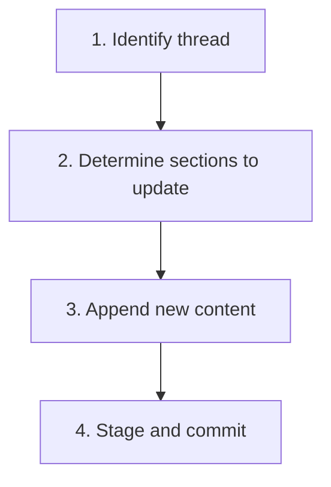

# Updating a Thread

## Guiding Principles

### Update, don't replace

Add new information to existing sections. Do not rewrite previous content — it provides historical context for the next agent.

### Append with timestamps

When adding to a thread, prefix entries with the current date so the resuming agent knows what was added when.

## Steps

<IMPORTANT>
**Before starting work on the steps below:**

1. Read the detailed instructions for each step in the sections that follow
2. Create a TodoWrite item for every step in this list

**MUST NOT modify this file to check off steps.**
</IMPORTANT>

- [ ] 1. Identify the thread to update
- [ ] 2. Determine what to update
- [ ] 3. Append new content
- [ ] 4. Stage and commit

### Step 1: Identify the thread to update

Locate the thread file.

<HARD-GATE>
Verify the thread is not in a `resolved/` subdirectory. If it is, do not update — the work is closed. Create a new thread if continuation context is needed.
</HARD-GATE>

### Step 2: Determine what to update

Ask the user or determine from context which sections need updates:

| Section | When to update |
|---------|---------------|
| **Unfinished Business** | New tasks emerged during work |
| **Open Questions** | New questions arose |
| **Decisions Pending** | New decisions needed from user |
| **Next Actions** | Priorities changed or actions were completed |
| **TODO** | Greppable markers need updating |

### Step 3: Append new content

Open the thread file and append new entries to the relevant section(s). Prefix with the date:

```markdown
- [2026-03-08] New item discovered during implementation
```

For **Next Actions**: if items were completed, mark them with ~~strikethrough~~ rather than deleting. Add new items at the appropriate priority position.

### Step 4: Stage and commit

Stage the updated thread and commit:

```
docs(thread): update <slug> — <what was added>
```

**Terminal state:** Thread updated with new information. No sections lost or overwritten.

## Workflow Diagram


