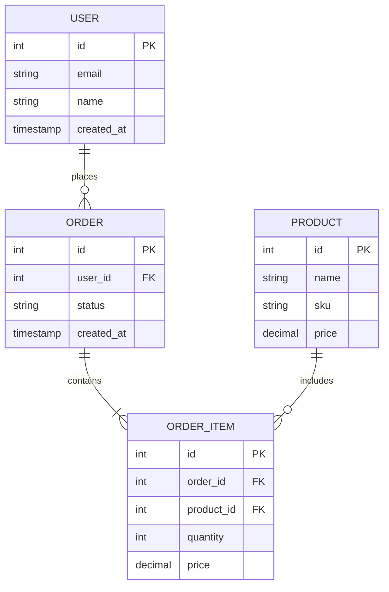
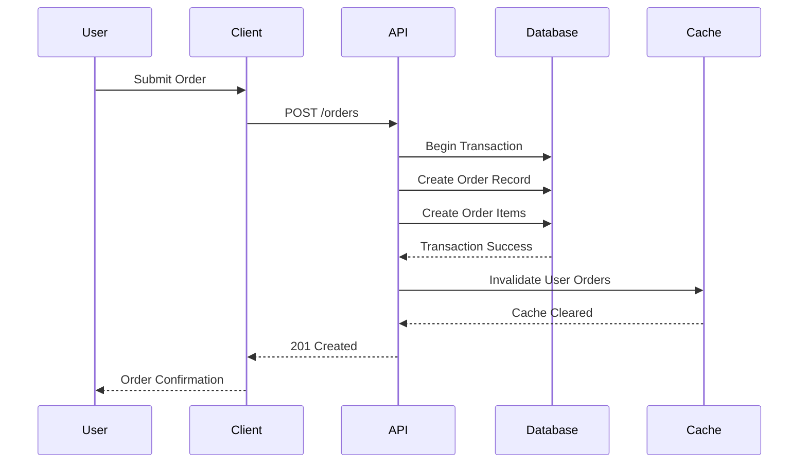
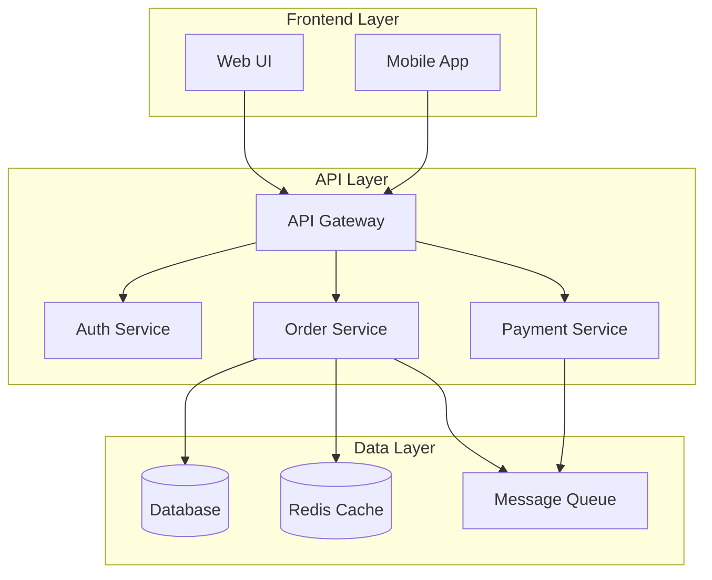
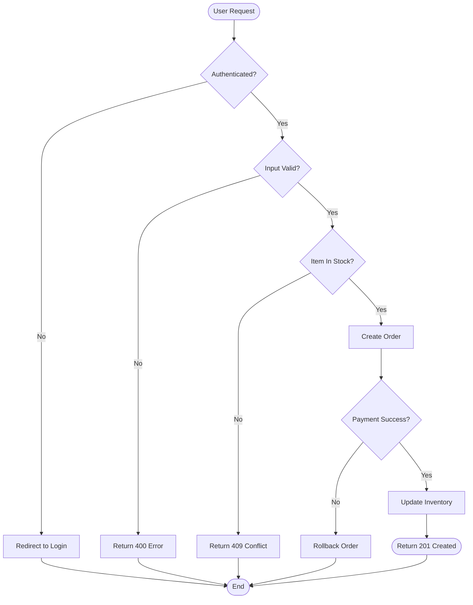

# Architecture Documentation: [Feature Name]

**Spec**: [Link to spec.md](spec.md)

## Overview

[Provide a high-level description of the feature architecture. Focus on:
- What this feature does at the system level
- How it integrates with existing components
- Major architectural patterns used (e.g., MVC, event-driven, layered)
- Key technologies involved (databases, APIs, frameworks)]

**When to create this document**:
- Complex features with database schema changes
- Multi-component integrations across services
- Non-obvious architectural decisions requiring visual explanation
- Features with complex data flows or state management

**When NOT to create this document**:
- Simple CRUD operations
- Straightforward single-component changes
- Features where text-based documentation is sufficient

## Architecture Diagrams

### Data Model (ERD)

Use this for database schema changes, entity relationships, or data structure design.

**Description**: [Explain the relationships, key design decisions, and data constraints]

---

### Sequence Diagram

Use this for API flows, user interactions, or multi-step processes.

**Description**: [Explain the flow, error handling, and important decision points]

---

### Component Diagram

Use this for showing how major system components interact.

**Description**: [Explain component responsibilities, communication patterns, and dependencies]

---

### Flowchart

Use this for decision logic, state machines, or algorithm flows.

**Description**: [Explain the decision points, error handling paths, and edge cases]

---

### Using Mermaid vs Image Files

**Use Mermaid when**:
- Diagram is simple to moderate complexity
- You want version-control friendly plain text
- Diagram needs frequent updates
- Standard diagram types (ERD, sequence, flowchart, class, component) are sufficient

**Use image files (PNG/SVG) when**:
- Diagram is highly complex with many elements
- You need professional diagramming tool features (draw.io, Lucidchart)
- Diagram includes custom graphics or logos
- Mermaid syntax becomes unwieldy

**Image file location**: Store complex diagrams in `assets/diagrams/` subfolder:
- `assets/diagrams/system-architecture.png`
- `assets/diagrams/database-schema.svg`
- `assets/diagrams/deployment-diagram.png`

## Key Design Decisions

### Decision 1: [Decision Title]

**Context**: [What problem or situation led to this decision?]

**Decision**: [What was decided?]

**Rationale**: [Why was this approach chosen? What alternatives were considered?]

**Consequences**: [What are the impacts, trade-offs, or constraints?]

---

### Decision 2: [Decision Title]

**Context**: [Problem description]

**Decision**: [What was decided]

**Rationale**: [Why this approach]

**Consequences**: [Trade-offs and impacts]

---

## Dependencies

### External Services

| Service | Purpose | Integration Point | Fallback Strategy |
|---------|---------|-------------------|-------------------|
| Stripe API | Payment processing | `/api/payments` | Queue for retry |
| SendGrid | Email notifications | Background jobs | Log and retry |
| Redis | Session cache | All API endpoints | Degrade gracefully |

### Internal Components

| Component | Version | Purpose | Breaking Changes |
|-----------|---------|---------|------------------|
| Auth Service | v2.1.0 | User authentication | None |
| Order Service | v1.5.0 | Order management | New field added |
| Inventory API | v3.0.0 | Stock tracking | v3 breaking changes |

### Database Schema

**Migrations Required**: Yes/No

**New Tables**: [List new tables or major schema changes]

**Modified Tables**: [List existing tables with schema modifications]

**Indexes**: [List new indexes for performance]

---

## Deployment Considerations

[Optional section - use if relevant]

- **Infrastructure Requirements**: [Servers, databases, caching]
- **Configuration Changes**: [Environment variables, feature flags]
- **Migration Strategy**: [How to roll out schema or code changes]
- **Rollback Plan**: [How to revert if issues arise]

---

**Last Updated**: {{ISO_TIMESTAMP}}
**Maintained By**: [Agent or team maintaining this document]

---

## Template Usage Notes

**Delete this section when creating actual architecture documentation**

1. Replace all `[bracketed placeholders]` with actual content
2. Remove sections that don't apply to your feature
3. Add additional diagram types if needed (state diagrams, deployment diagrams, etc.)
4. Keep diagrams focused - one concept per diagram
5. Update Date Updated timestamp whenever changes are made
6. Store complex diagrams in `assets/diagrams/` folder
7. Link to diagrams using relative markdown links: ``
